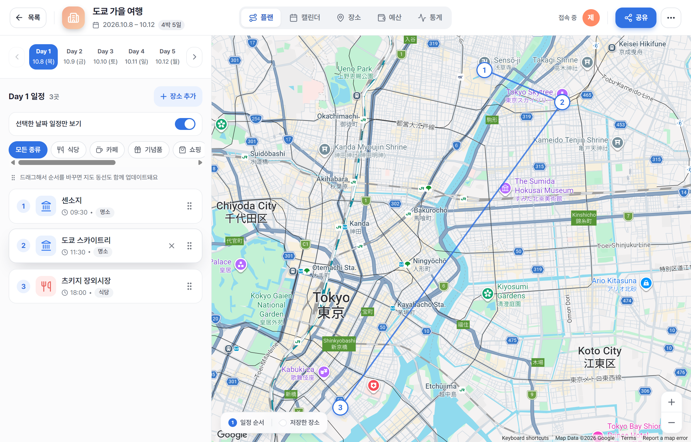
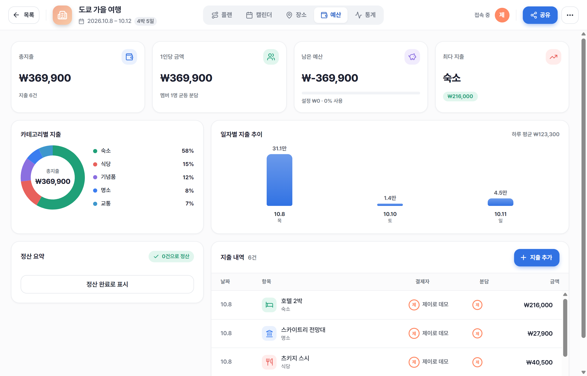
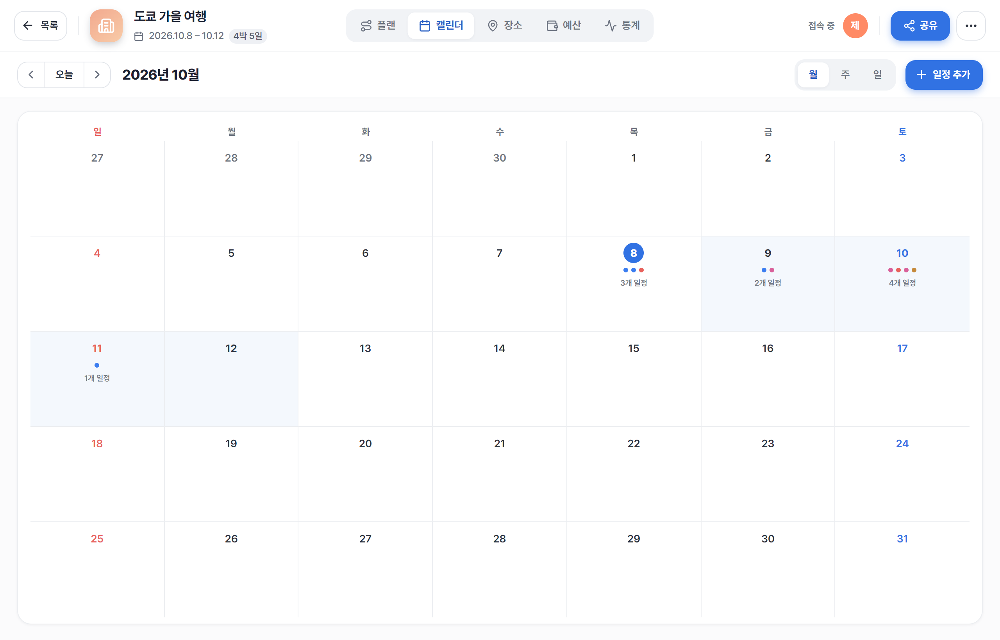
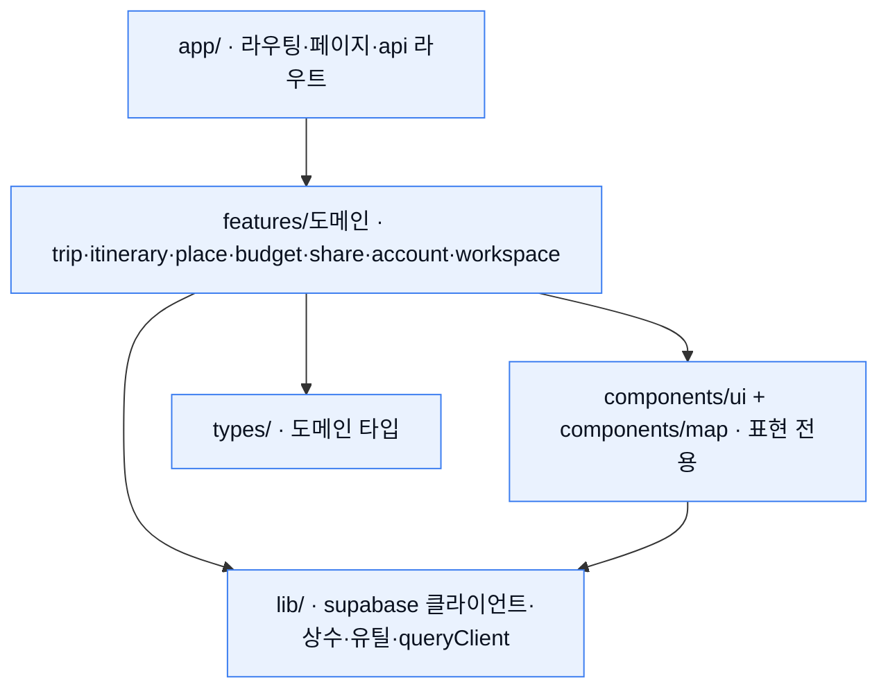
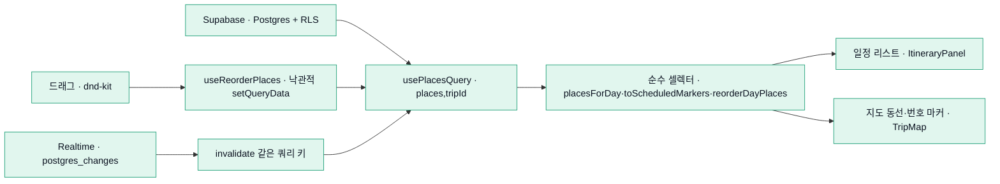

# 제이로 (jero)

> **jero**는 친구들과 함께 여행을 계획하는 협업 여행 플래너입니다 — 지도에 장소를 저장하는 데 그치지 않고 **순서·동선·예산·역할**을 팀으로 함께, **실시간으로** 관리합니다.
> 4년간의 데이터 밀집 어드민 UI 경험(테이블·필터·차트·워크플로우·권한)을 최신 스택 위의 소비자 협업 제품으로 재구성한 포트폴리오입니다.
> Stack: Next.js 16 (App Router) · React 19 · TypeScript · Tailwind v4 · TanStack Query · Zustand · Google Maps · **Supabase**(Auth·Postgres+RLS·Realtime).
> **Live demo → https://jero-travel.vercel.app**

**라이브 데모:** https://jero-travel.vercel.app · **문서:** [`docs/`](./docs)


> **Lighthouse(프로덕션 `/`, 데스크톱)**: 성능 **100** · 접근성 **100** · 권장사항 **100** · SEO **100**.
> 측정으로 병목(폰트 2MB)을 특정해 **동적 서브셋**으로 개선 → LCP 2.3s→**0.6s**, 성능 87→**100**. 상세는 [`docs/tech-decisions.md`](./docs/tech-decisions.md) §8.

---

**제이로**(`J`=MBTI 계획형 + `路`=길·동선, 발음은 "제일로")는 친구들과 함께 여행 일정을 짜고
**장소 순서·동선·예산·역할**까지 여러 명이 함께 관리하는 협업 여행 플래너(웹)입니다.
위치 저장에 그치지 않고 *누가·언제·어떤 순서로·얼마에* 움직일지를 한 화면에서 정리합니다.

두 개의 계정으로 같은 여행에 접속하면, 한쪽의 장소 추가·순서 변경이 다른 쪽 화면에 실시간으로 반영되고 접속 중 멤버 아바타가 표시됩니다.

---

## 체험하기

가입 없이 바로 둘러보거나, 데모 계정으로 직접 만들어볼 수 있어요.

- **바로 둘러보기(읽기 전용)** — https://jero-travel.vercel.app/share/7f55de93fd5cd1ddde
- **직접 만들어보기(데모 계정)** — `demo@jero.travel` / `JeroDemo2026!`

> 샘플 데이터: *도쿄 가을 여행*(장소 12 · 일정 배정 · 예산·정산 포함). 공용 체험 계정이라 방문자가 데이터를 바꿀 수 있어요.

---

## 스크린샷

| 플랜 뷰 (동선 + 지도) | 예산 대시보드 | 캘린더 |
|---|---|---|
|  |  |  |

*좌: 일정 리스트를 드래그하면 지도 동선 Polyline·번호 마커가 즉시 갱신됩니다. 중: Recharts 차트 + 멤버별 정산. 우: 월/주/일 캘린더.*

---

## 핵심 기능

- **실시간 협업 편집** — 같은 여행에 접속한 멤버의 장소 추가·순서 변경이 서로의 화면에 자동 반영(Supabase Realtime). 접속 중 멤버 아바타 + **실시간 커서**(타 멤버 포인터, broadcast throttle).
- **플랜 뷰** — 좌측 일정 리스트 + 우측 Google Maps. 순서대로 동선(Polyline)·번호 마커, 카테고리 mute, 카드↔마커 양방향 하이라이트.
- **드래그 동선** — 일정 카드를 드래그(포인터 + 키보드)해 순서를 바꾸면 리스트·번호 마커·동선이 **즉시** 갱신되고 서버에 반영(낙관적 업데이트 + 실시간 동기화).
- **동선 최적화** — 하루 동선을 버튼 한 번으로 **최소 이동 순서로 자동 정렬**(Nearest-Neighbor + **2-opt** 휴리스틱). **직선거리** 또는 **실제 이동시간**(Google Distance Matrix, 실패 시 직선거리 폴백), 숙소 **시작/복귀 앵커** 지원. 적용 전 **총 이동 전/후 비교** 미리보기 + 되돌리기. 순수 알고리즘은 `lib/route/`로 분리(TDD).
- **지도에서 장소 추가** — Google **Places 검색**(오버레이 + 지도 상단 검색창)·**지도 빈 곳 클릭**(reverse geocoding)·**POI 라벨 클릭**(place 상세) 네 경로로 좌표째 저장 → 지도 마커·플랜 동선에 표시. 장소 패널은 **드래그로 넓히거나 접어** 지도를 크게 볼 수 있습니다.
- **일정표 / 장소 / 폴더** — 월·주·일 캘린더 조망, 장소를 **폴더로 분류·관리**하고 특정 날짜에 "일정에 추가" / "일정에서 빼기". 메모 인라인 자동저장(debounce).
- **다중 도시 여행** — 한 여행에 여러 도시(박수·순서)를 두면 날짜가 자동 배분됩니다. 플랜·캘린더에 **도시 컨텍스트**(도시 라벨·색·시작일 배지·경계), 도시 전환 시 지도 중심 이동, 장소를 **도시 축**으로 필터/그룹, 도시가 바뀌는 경계에 **이동 세그먼트 카드**(기차/항공/버스, 출발 시각·소요). 단일 도시 여행은 기존과 동일(회귀 0).
- **여행 생성 마법사** — 다단계 폼(제목·지역·기간·멤버·권한). 빈 여행 또는 **템플릿 복제로 시작**(도쿄·제주 시드를 서버 RPC로 복제).
- **예산·정산** — 카테고리 도넛·일별 추이 차트 + 지출 테이블. 지출 추가·편집, 분담(split) 관리, 멤버별 정산 **라이브 재계산**.
- **여행 통계** — 총 이동거리(Haversine)·일자별 이동·카테고리 분포를 차트로 요약(`?view=stats`).
- **팜플렛 내보내기** — 완성한 일정을 **A4 3단 접이 팜플렛**으로. 테마 프리셋(패턴 + 일러스트 씬)·섹션 체크 선택·QR(읽기 전용 공유 링크 재사용)·인쇄/PDF.
- **공유·초대·권한** — `owner` / `editor` / `viewer`. 읽기 전용 공개 링크(토큰 스코프·민감 필드 제외), 편집 초대 링크 수락. 권한은 UI가 아니라 서버/RLS에서 강제.
- **인증·계정** — 이메일/비번 + **구글 OAuth** 로그인, **비밀번호 재설정**(복구 메일 → 새 비밀번호 설정). 프로필·기본 통화 설정, **프로필 사진 업로드**(Supabase Storage, 없으면 색·이니셜 폴백), 계정 탈퇴(소유 여행 owner 승계 또는 cascade 삭제).

## 기술 스택

| 영역 | 선택 | 왜 |
|---|---|---|
| 프레임워크 | **Next.js 16** (App Router, Turbopack) | 서버/클라 경계·`proxy` 라우트 가드로 인증을 서버 경계에서 강제. |
| 런타임 | **React 19** | 최신 동시성·`useSyncExternalStore` 등 안정 API 활용. |
| 언어 | **TypeScript (strict)** | 계약(타입) 우선 설계 — `any`/비검증 `unknown` 금지. |
| 스타일 | **Tailwind v4** (CSS-first `@theme`) + shadcn/ui | 토큰 단일 출처로 밀도 높은 UI를 일관되게. |
| 서버 상태 | **TanStack Query** | 캐시·무효화·낙관적 업데이트를 seam으로 캡슐화, 실시간과 결합. |
| 클라 상태 | **Zustand** | 선택·필터·모드 등 가벼운 UI 상태(서버 상태와 혼용 금지). |
| 테이블·가상화 | **TanStack Table / Virtual** | 지출 등 데이터 밀집 영역의 정렬·가상 스크롤. |
| 폼 | **React Hook Form + Zod** | 클라 UX + 서버 신뢰 경계 양쪽 동일 스키마 검증. |
| 차트 | **Recharts** | 예산 대시보드(도넛·막대)를 카테고리 토큰 색으로. |
| 지도 | **Google Maps** (`@react-google-maps/api`) | 해외 여행 포함, 벡터 맵 + AdvancedMarkerElement. |
| 드래그 | **dnd-kit** | 접근성(키보드 센서) 있는 정렬, 필터 중 비활성 제어. |
| 백엔드 | **Supabase** (Auth · Postgres + RLS · Realtime) | 인증·행 단위 보안·실시간을 하나의 계약으로 통합. |
| 테스트 | **Vitest + Testing Library / Playwright** | 데이터→렌더 통합 + 실 Supabase e2e. |
| 패키지·배포 | **yarn (1.x)** · **Vercel** | — |

## 아키텍처

**의존 방향** — 단방향(`app → features → components·lib·types`). 도메인 간 직접참조를 금지하고, 공유가 필요하면 `lib`/`components`로 승격합니다. 지도는 도메인 로직이 없는 **표현 전용** 레이어라 `components/map`으로 승격해 여러 도메인이 공유합니다. `app/`은 라우팅 전용, 비즈니스 로직은 도메인별 `features/`(account·auth·budget·invite·itinerary·place·share·trip·workspace·system)로 응집합니다.



**데이터 흐름** — `usePlacesQuery` 하나가 여러 뷰의 **단일 출처**이고, 순수 셀렉터가 도메인 데이터를 화면/지도 뷰모델로 투영합니다(도메인/표현 분리). 드래그 재정렬은 쿼리 캐시를 낙관적으로 갱신해 리스트와 지도가 같은 소스에서 함께 다시 그려지고, Realtime `postgres_changes`가 타 멤버의 변경을 같은 쿼리 키로 무효화해 자동 동기화합니다.



- **공통 셸**: 워크스페이스 4뷰(플랜/일정표/장소/예산)는 상단 바·프레즌스·오버레이를 공유하는 `WorkspaceShell`이 본문만 교체합니다.
- **단일 출처 계약**: 데이터 계약은 [`docs/architecture/데이터모델_계약.md`](./docs/architecture/데이터모델_계약.md) 한 곳에서만 정의하고, DB 스키마 + 생성 타입이 프론트·백의 공유 진실입니다. 응답 타입을 클라이언트에서 다시 정의하지 않습니다.
- **표현/도메인 분리**: `components/map`은 `lat/lng`·순서만 받는 표현 레이어이며 도메인 타입을 모릅니다.
- **보안은 서버에서 강제**: "UI에서 감추는 것은 보안이 아니다" — 모든 접근을 **RLS**로 행 단위 강제하고, 민감 동작은 서버 라우트에서 세션을 재검증합니다. Zod로 클라이언트(UX)·서버(신뢰 경계) 양쪽을 검증합니다.

## 엔지니어링 결정 & 트러블슈팅

실제 구현/검증 중 부딪히고 해결한 문제들입니다. (포트폴리오 관점에서 가장 봐주셨으면 하는 섹션 — 각 항목 "증상 → 원인 → 해결")

### 실시간 private 채널이 조용히 죽던 문제 — `setAuth` 누락

Realtime private 채널이 `SUBSCRIBED`처럼 보이는데도 postgres_changes·presence가 전혀 오지 않았고, 뚜렷한 콘솔 에러도 없었습니다. 원인은 구독 **전에** `supabase.realtime.setAuth(access_token)`을 호출하지 않은 것. 이게 없으면 private 채널이 인가에 실패해 `CHANNEL_ERROR`로 **조용히** 죽고 그 위 실시간 기능 전체가 함께 죽습니다. 구독 직전 `setAuth`를 넣어 데이터 동기화를 정상화했습니다.

### presence sync 미전달 → broadcast heartbeat로 우회

"접속 중 멤버"를 네이티브 Realtime presence로 구현했는데, `track()`이 `ok`를 반환하고 채널이 `SUBSCRIBED`인데도 `sync` 이벤트가 오지 않았습니다. 같은 채널에서 기능을 분리 측정하니 **broadcast(self-receive)·postgres_changes는 정상**이고 **presence sync만** public·private 모두 전달되지 않았습니다(브라우저·순수 supabase-js 동일) → 앱 코드·인가·소켓이 아닌 presence 기능의 서버측 전달 문제로 좁혔습니다. 정상 동작하는 broadcast로 **heartbeat** 우회: 구독 시 + 12초 주기로 자기 user id를 broadcast, 피어는 수신 시각을 30초 TTL로 만료(5초 prune), `self:true`로 자신도 포함. 인터페이스(`onlineIds`)를 유지해 훅 내부만 교체, 상위 컴포넌트는 무변경이었습니다.

### 계정 탈퇴 — FK가 `NO ACTION`이라 참조 재배정

계정 삭제 시 대부분의 FK가 `NO ACTION`이라 참조가 남아 삭제가 막혔습니다. 스키마를 cascade로 바꾸는 대신 서버 라우트(`DELETE /api/account`)에서 정리: 세션 재확인 → **유일 owner인 여행은 다른 멤버(editor 우선 → 오래된 순)에게 owner 승계**, 혼자면 여행 cascade 삭제, 생존 여행의 내 참조(NOT NULL FK)는 승계자에게 재배정하고 `saved_by`/`scheduled_by`는 NULL 처리 → `auth.admin.deleteUser`(service role, 서버 전용) → 클라 signOut. 마이그레이션 변경 없이 애플리케이션 계층에서 안전하게 처리했습니다.

### 정산을 저장하지 않고 라이브 재계산 (단일 출처)

지출 편집과 정산 상태가 충돌할 수 있었습니다. 정산 결과를 저장하는 대신 **항상 지출에서 파생 계산**(`computeSettlements`)하도록 설계해 충돌을 원천 차단했습니다. 지출을 편집해도 `trip.settled_at`을 건드리지 않고, 지표·차트·정산이 무효화 하나로 함께 재계산됩니다. 단일 출처 원칙을 정산에도 적용한 결정입니다.

### RLS 재귀 회피 — security-definer 헬퍼

멤버십 기반 RLS 정책이 자기 테이블을 다시 참조하며 재귀에 빠졌습니다. `is_trip_member(t)`·`trip_role(t)`를 **security definer** 함수로 분리해 정책에서 호출하도록 해 재귀 없이 행 단위 접근을 강제했습니다.

### 통합 e2e가 잡아낸 목록 화면 500

실인증 기반으로 e2e를 재작성하면서, 부트스트랩이 `trip.cover`에 hex 값을 넣자 `/trips` 목록의 `TripCard`(`COVER[cover_color].gradient`)가 500을 냈습니다. 개별 spec들은 목록 화면을 거치지 않아 놓쳤던 경로를 **관통 통합 테스트**가 잡아냈습니다. 유효 키로 교체해 해결(앱의 생성 마법사는 항상 유효 키를 보내므로 사용자 경로는 무관).

### 계약 우선 seam — 스텁 → Supabase 무중단 전환

데이터 통신은 전부 `features/<도메인>/api`의 훅을 경유합니다. 백엔드 연동 전에는 `queryFn`이 계약 응답 예시(fixture)를 반환하는 스텁이었고, **훅 시그니처·쿼리 키·무효화 키를 먼저 확정**한 뒤 내부만 Supabase 호출로 교체했습니다. 화면 코드는 그대로였고, 응답 예시를 테스트 fixture로 재사용해 "계약 = 단일 출처"를 유지했습니다.

### 지도 인증 실패 방어 (`gm_authFailure`)

스크립트는 정상 로드됐지만 지도 인증이 실패(`RefererNotAllowedMapError` 등)하면 `useJsApiLoader`의 `loadError`로는 안 잡히고 `GoogleMap`이 렌더돼 상호작용이 에러 바운더리로 튑니다. 전역 `window.gm_authFailure`를 `useSyncExternalStore`로 구독해 `loadError`와 동일하게 error fallback으로 분기합니다.

### 테스트 OOM → 직렬 실행

jsdom + Recharts/base-ui 무거운 트리를 파일 병렬로 올리면 워커들이 합쳐 힙 OOM으로 죽었습니다(개별 파일은 통과). `vitest.config`의 `fileParallelism: false`로 peak 메모리를 묶었습니다.

### `yarn check` 함정

yarn 1.x에서 `yarn check`는 **의존성 무결성 검사(내장 명령)**라 프로젝트 스크립트가 아닙니다. 게이트(typecheck+lint+test)는 반드시 **`yarn run check`**로 실행합니다.

### 팜플렛 PDF — print 폴백에서 서버 headless Chromium으로 승격

여행 팜플렛(A4 3단)을 서버 headless Chromium(`puppeteer-core` + `@sparticuz/chromium`)으로 무인 PDF 다운로드합니다. 초기엔 **이 환경의 Node 20 vs 라이브러리 node22 요구가 충돌**해 배포 안전을 우선한 **`window.print()` 폴백**으로 시작했고, 이후 **Node 22로 올린 뒤 `POST /api/pamphlet/export`**(세션·멤버십 재검증)로 승격해 프로덕션 서버리스 크로미움에서 A4 PDF가 실동작합니다(실패 시 `window.print()` 폴백 유지). 인쇄 라우트가 미리보기와 **동일 컴포넌트·`faces` 레이아웃을 재사용**하고, 편집한 준비물도 쿼리로 관통해 PDF에 반영됩니다. (참고: `std-env` 등 툴체인이 `require(ESM)`을 요구해 **개발/CI Node는 22.12+** 필요.)

## 테스트

- **단위·통합**: Vitest + Testing Library — 295 tests. "데이터 응답 → 화면 렌더링" 통합 검증을 유닛 테스트보다 우선.
- **e2e**: Playwright — 21 tests, **실 Supabase** 대상. service_role 부트스트랩으로 실인증, 생성 데이터 티어다운. 2계정 2컨텍스트로 실시간 협업(데이터 동기화·presence·커서)까지 검증(account·budget·flows·home·realtime·folder·stats·pamphlet 등).

```bash
yarn run check      # typecheck + lint + Vitest(295 tests) — 커밋/PR 전 게이트
yarn test           # Vitest 단위·통합 (1회)
yarn test:e2e       # Playwright e2e (실 Supabase)
```

검증은 **각 화면의 수용 기준(기획문서 §11) → 테스트/실렌더**로 이어집니다. 데이터 응답→화면 렌더링 통합 테스트를 유닛 테스트보다 우선하고, 지도·드래그·실시간처럼 브라우저가 필요한 흐름은 Playwright 실렌더로 확인합니다.

## 로컬 실행

```bash
# 요구: Node 22.12+, yarn 1.x
yarn install

# 환경변수 — .env.local (커밋 금지)
#   NEXT_PUBLIC_SUPABASE_URL=...
#   NEXT_PUBLIC_SUPABASE_ANON_KEY=...
#   SUPABASE_SERVICE_ROLE_KEY=...          (서버 전용 — 계정 삭제 라우트. NEXT_PUBLIC_ 아님)
#   NEXT_PUBLIC_GOOGLE_MAPS_API_KEY=...    (지도 렌더 + 장소 검색·지오코딩)
#   NEXT_PUBLIC_GOOGLE_MAPS_MAP_ID=...     (선택 — 벡터 맵 + AdvancedMarker)

yarn dev                    # http://localhost:3000
yarn build && yarn start    # 프로덕션
```

Supabase 스키마는 `supabase/migrations/`를 순서대로 적용합니다: `0001_auth`(인증·profile 프로비저닝) · `0002_data`(trips/places/budget·RLS·RPC) · `0003_share`(공유·초대) · `0004_realtime`(퍼블리케이션·realtime.messages RLS) · `0005_templates`(여행 템플릿 카탈로그·시드 + `create_trip` 복제) · `0006_multicity`(`trip_city` + `place.city_id` + 백필·하위호환) · `0007_city_transfer`(`trip_city.arrival_*` 도시 간 이동). 아바타 업로드에는 public `avatars` 스토리지 버킷(본인 경로 쓰기 RLS)이 필요합니다.

> Google Maps API 키는 클라이언트 노출 전제입니다. 콘솔에서 **HTTP referrer(도메인) 제한 + 사용 API 범위 제한**을 걸어 두세요. 장소 기능에는 **Maps JavaScript · Places · Geocoding API**를 사용 설정해야 합니다. 구글 소셜 로그인은 Google OAuth 클라이언트의 리디렉션 URI를 **Supabase 콜백**(`https://<ref>.supabase.co/auth/v1/callback`)으로 등록합니다. `SUPABASE_SERVICE_ROLE_KEY`는 서버 전용이며 절대 클라이언트에 노출하지 않습니다.

## 문서 지도

| 문서 | 위치 | 역할 |
|---|---|---|
| 기능명세서 | [`docs/spec/기능명세서.md`](./docs/spec/기능명세서.md) | 무엇을 만드는가(기능·범위·데이터·권한) |
| 화면구조 와이어프레임 | [`docs/spec/화면구조_와이어프레임.md`](./docs/spec/화면구조_와이어프레임.md) | 어떤 화면에 무엇이 들어가는가 |
| 페이지별 기획 | [`docs/planning/`](./docs/planning) | 화면 단위 상세 기획(01~17, 동선 최적화·다중 도시 포함) + 수용 기준 |
| 설계문서 · 계약 | [`docs/architecture/`](./docs/architecture) | 데이터 모델·상태관리·API 계약·RLS·Realtime·2차 구현·팜플렛 설계 |
| 동선 최적화 설계 | [`docs/architecture/동선_최적화_설계.md`](./docs/architecture/동선_최적화_설계.md) | NN+2-opt·비용 매트릭스·실이동시간·앵커 |
| 다중 도시 설계 | [`docs/architecture/다중_도시_설계.md`](./docs/architecture/다중_도시_설계.md) | 도시 정규화·날짜 파생·하위호환·Phase 1~5(이동 세그먼트) |
| QA 수정 트래킹 | [`docs/qa/fix-requests.md`](./docs/qa/fix-requests.md) | 테스트·피드백 수정 요청과 상태 |
| 미구현 기능 갭 | [`docs/remaining-features.md`](./docs/remaining-features.md) | 설계 대비 구현 갭·후속 목록 |
| 디자인 시안 | [`docs/design/prototype/`](./docs/design/prototype) | 시각 참고(HTML) |
| 기술 선택 근거 · 현업 대비 | [`docs/tech-decisions.md`](./docs/tech-decisions.md) | 왜 이 스택인가 + 현업(B2B) 대비 코드·운영 차이 (보고서) |

## 포트폴리오 관점

데이터 밀집 **어드민 UI 역량(4년)** — 테이블·필터·차트·워크플로우·권한 — 을 최신 스택 위의 소비자 협업 제품으로 재구성한 작업입니다. 그 역량이 드러나는 지점:

- **예산 대시보드** — Recharts 차트 + 지출 테이블 + 멤버별 정산(집계·워크플로우·라이브 재계산).
- **실시간 협업** — Supabase Realtime로 다중 사용자 동시 편집·프레즌스, 낙관적 업데이트와의 reconciliation.
- **권한/보안** — owner/editor/viewer 분기 + RLS 행 단위 강제 + 서버 라우트 세션 재검증(계정 삭제·owner 승계).
- **완성도** — 계약 우선 설계로 스텁→Supabase 무중단 전환, 디자인 토큰 단일 출처, 접근성 있는 드래그(키보드), 그레이스풀 폴백(키 없음/인증 실패/로딩), 실 Supabase e2e.

---

<sub>코드·커밋은 영어, 문서·주석은 한국어. 상세 규약은 [`CLAUDE.md`](./CLAUDE.md) 참고.</sub>
