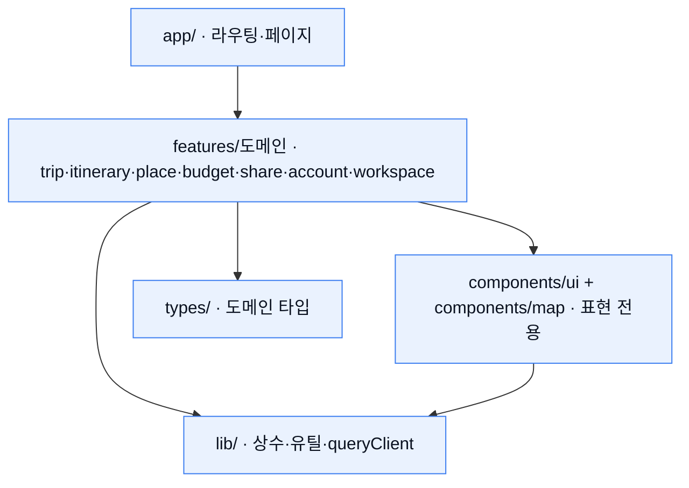
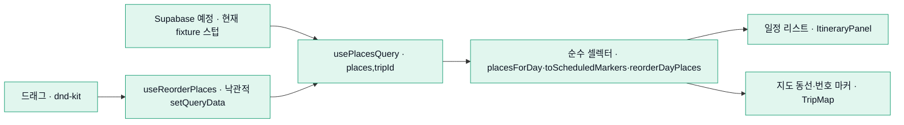

# 제이로 (jero)

> **jero** is a collaborative travel planner for friends who plan trips *together* — not just saving pins, but managing the **order, route, budget, and roles** as a team.
> Built as a portfolio piece: it applies 4 years of data-dense admin-UI experience (tables, filters, charts, workflows, permissions) to a modern consumer collaboration product.
> Stack: Next.js 16 (App Router) · React 19 · TypeScript · Tailwind v4 · TanStack Query · Google Maps. Backend is intentionally a contract-first **seam** (stubbed), ready to swap to Supabase.
> **Live demo → https://jero-travel.vercel.app**

**라이브 데모:** https://jero-travel.vercel.app · **문서:** [`docs/`](./docs)


---

**제이로**(`J`=MBTI 계획형 + `路`=길·동선, 발음은 "제일로")는 친구들과 함께 여행 일정을 짜고
**장소 순서·동선·예산·역할**까지 여러 명이 함께 관리하는 협업 여행 플래너(웹)입니다.
위치 저장에 그치지 않고 *누가·언제·어떤 순서로·얼마에* 움직일지를 한 화면에서 정리합니다.

---

## 스크린샷

> 아래 이미지는 `docs/screenshots/` 에 넣습니다(파일명은 그대로 두면 자동으로 렌더됩니다). 1280px 기준 캡처 권장.

| 플랜 뷰 (동선 + 지도) | 예산 대시보드 | 일정표 |
|---|---|---|
|  |  |  |

*좌: 일정 리스트를 드래그하면 지도 동선 Polyline·번호 마커가 즉시 갱신됩니다. 중: Recharts 차트 + 멤버별 정산. 우: 월/주/일 캘린더.*

---

## 핵심 기능

- **플랜 뷰** — 좌측 일정 리스트 + 우측 Google Maps. 순서대로 동선(Polyline)·번호 마커, 카테고리 mute, 카드↔마커 양방향 하이라이트, 타 멤버 실시간 커서(목).
- **드래그 동선** — 일정 카드를 드래그(포인터 + 키보드)해 순서를 바꾸면 리스트·번호 마커·동선이 **즉시** 갱신(낙관적 업데이트).
- **일정표** — 월/주/일 캘린더 모드로 같은 여행을 시간축에서 조망.
- **장소** — 폴더로 저장한 장소를 관리하고 "일정에 추가"로 특정 날짜에 배정.
- **예산** — 카테고리 도넛·일별 추이 차트 + 지출 테이블 + 멤버별 **정산** 요약.
- **공유** — 읽기 전용 공개 링크(토큰)로 비멤버에게 스냅샷 공유(이메일·예산 등 민감 필드 제외).
- **권한** — `owner` / `editor` / `viewer`. viewer는 "보기 전용"·"공유받은 플랜" 배지와 함께 편집·추가·공유·드래그 UI가 감춰집니다(권한은 서버/RLS에서 강제하는 설계).

## 기술 스택

| 영역 | 선택 | 왜 |
|---|---|---|
| 프레임워크 | **Next.js 16** (App Router, Turbopack) | 서버/클라 경계·파일 라우팅·이미지/폰트 최적화를 표준으로. |
| 런타임 | **React 19** | 최신 동시성·`useSyncExternalStore` 등 안정 API 활용. |
| 언어 | **TypeScript (strict)** | 계약(타입) 우선 설계 — `any`/비검증 `unknown` 금지. |
| 스타일 | **Tailwind v4** (CSS-first `@theme`) + shadcn/ui | 토큰 단일 출처로 밀도 높은 UI를 일관되게. |
| 서버 상태 | **TanStack Query** | 캐시·무효화·낙관적 업데이트를 seam으로 캡슐화. |
| 클라 상태 | **Zustand** | 선택·필터·모드 등 가벼운 UI 상태(서버 상태와 혼용 금지). |
| 테이블·가상화 | **TanStack Table / Virtual** | 지출 등 데이터 밀집 영역의 정렬·가상 스크롤. |
| 폼 | **React Hook Form + Zod** | 클라 UX + 서버 신뢰 경계 양쪽 동일 스키마 검증. |
| 차트 | **Recharts** | 예산 대시보드(도넛·막대)를 카테고리 토큰 색으로. |
| 지도 | **Google Maps** (`@react-google-maps/api`) | 해외 여행 포함, 벡터 맵 + AdvancedMarkerElement. |
| 드래그 | **dnd-kit** | 접근성(키보드 센서) 있는 정렬, 필터 중 비활성 제어. |
| 테스트 | **Vitest + Testing Library / Playwright** | 데이터→렌더 통합 + 핵심 플로우 e2e. |
| 패키지·배포 | **yarn (1.x)** · **Vercel** | — |

## 아키텍처

**의존 방향** — 단방향(`app → features → components·lib·types`). 도메인 간 직접참조를 금지하고, 공유가 필요하면 `lib`/`components`로 승격합니다. 지도는 도메인 로직이 없는 **표현 전용** 레이어라 `components/map`으로 승격해 여러 도메인이 공유합니다.



**데이터 흐름** — `usePlacesQuery` 하나가 04·05·06의 **단일 출처**이고, 순수 셀렉터가 도메인 데이터를 화면/지도 뷰모델로 투영합니다(도메인/표현 분리). 드래그 재정렬은 쿼리 캐시를 낙관적으로 갱신해 리스트와 지도가 같은 소스에서 함께 다시 그려집니다.



- **공통 셸**: 워크스페이스 4뷰(플랜/일정표/장소/예산)는 상단 바·프레즌스·오버레이를 공유하는 `WorkspaceShell`이 본문만 교체합니다.
- **단일 출처**: 화면·지도·오버레이가 같은 쿼리 키를 공유 → 한 곳이 바뀌면 모두 동기화.
- **표현/도메인 분리**: `components/map`은 `lat/lng`·순서만 받는 표현 레이어이며 도메인 타입을 모릅니다.

## 엔지니어링 결정 & 트러블슈팅

실제 구현/검증 중 내린 판단과 함정들입니다. (포트폴리오 관점에서 가장 봐주셨으면 하는 섹션)

- **계약 우선 seam (백엔드 스텁)** — 데이터 통신은 전부 `features/<도메인>/api`의 훅을 경유합니다. 지금은 `queryFn`이 계약 응답 예시(fixture)를 반환하고 뮤테이션은 스텁이지만, **Supabase로 교체 시 이 seam의 내부만 바꾸면** 화면 코드는 그대로입니다. 응답 예시를 테스트 fixture로 재사용해 "계약 = 단일 출처"를 유지합니다.
- **드래그 낙관적 갱신** — `useReorderPlaces`가 `onMutate`에서 `['places']` 캐시를 재배치(`order_in_day` 재부여)해 리스트·지도가 즉시 반영됩니다. 백엔드 전이라 성공 후 `invalidate`를 **하지 않습니다** — refetch하면 fixture 원순서로 되감기기 때문. 실연동 시 `onSettled` invalidate로 재동기화하도록 TODO를 남겨뒀습니다.
- **지도 인증 실패 방어 (`gm_authFailure`)** — 스크립트는 정상 로드됐지만 지도 인증이 실패(`RefererNotAllowedMapError` 등)하면 `useJsApiLoader`의 `loadError`로는 안 잡히고 `GoogleMap`이 렌더돼 상호작용이 에러 바운더리로 튑니다. 전역 `window.gm_authFailure`를 `useSyncExternalStore`로 구독해 `loadError`와 동일하게 error fallback으로 분기합니다.
- **Vector → Raster 폴백** — Map ID는 벡터 타입이고 최신 `AdvancedMarkerElement`를 씁니다. "Attempted to load a Vector Map… falling back to Raster" 경고는 **WebGL 미지원 환경(헤드리스 CI 등)에서만** 뜨는 안내이며 기능에는 영향이 없어, 최신 마커 스택을 위해 벡터 Map ID를 유지합니다.
- **테스트 OOM → 직렬 실행** — jsdom + Recharts/base-ui 무거운 트리를 파일 병렬로 올리면 워커들이 합쳐 힙 OOM으로 죽었습니다(개별 파일은 통과). `vitest.config`의 `fileParallelism: false`로 peak 메모리를 묶었습니다.
- **`yarn check` 함정** — yarn 1.x에서 `yarn check`는 **의존성 무결성 검사(내장 명령)**라 프로젝트 스크립트가 아닙니다. 게이트(typecheck+lint+test)는 반드시 **`yarn run check`**로 실행합니다.

## 로컬 실행

```bash
# 요구: Node 20+, yarn 1.x
yarn install

# 환경변수 — .env.local (커밋 금지). 예시는 .env.example 참고.
#   NEXT_PUBLIC_GOOGLE_MAPS_API_KEY=...   (지도 렌더에 필요)
#   NEXT_PUBLIC_GOOGLE_MAPS_MAP_ID=...    (선택 — 벡터 맵 + AdvancedMarker)
# 키가 없어도 앱은 깨지지 않고 지도 자리표시(MapFallback)로 동작합니다.

yarn dev                    # http://localhost:3000
yarn build && yarn start    # 프로덕션
```

> Google Maps API 키는 클라이언트 노출 전제입니다. 콘솔에서 **HTTP referrer(도메인) 제한 + 사용 API 범위 제한**을 걸어 두세요.

## 테스트

```bash
yarn run check      # typecheck + lint + Vitest(68 tests) — 커밋/PR 전 게이트
yarn test           # Vitest 단위·통합 (1회)
yarn test:e2e       # Playwright e2e (dev 서버 자동 기동)
```

검증은 **각 화면의 수용 기준(기획문서 §11) → 테스트/실렌더**로 이어집니다. 데이터 응답→화면 렌더링 통합 테스트를 유닛 테스트보다 우선하고, 지도·드래그처럼 브라우저가 필요한 흐름은 Playwright 실렌더로 확인합니다.

## 문서 지도

| 문서 | 위치 | 역할 |
|---|---|---|
| 기능명세서 | [`docs/spec/기능명세서.md`](./docs/spec/기능명세서.md) | 무엇을 만드는가(기능·범위·데이터·권한) |
| 화면구조 와이어프레임 | [`docs/spec/화면구조_와이어프레임.md`](./docs/spec/화면구조_와이어프레임.md) | 어떤 화면에 무엇이 들어가는가 |
| 페이지별 기획 | [`docs/planning/`](./docs/planning) | 화면 단위 상세 기획(01~11) + 수용 기준 |
| 설계문서 | [`docs/architecture/`](./docs/architecture) | 데이터 모델·상태관리·API 계약·구글맵 연동 |
| 디자인 시안 | [`docs/design/prototype/`](./docs/design/prototype) | 시각 참고(HTML) |

## 포트폴리오 관점

데이터 밀집 **어드민 UI 역량(4년)** — 테이블·필터·차트·워크플로우·권한 — 을 최신 스택 위의 소비자 협업 제품으로 재구성한 작업입니다. 그 역량이 드러나는 지점:

- **예산 대시보드** — Recharts 차트 + 지출 테이블 + 멤버별 정산(집계·워크플로우).
- **일정표** — 월/주/일 모드와 데이터 밀집 리스트(TanStack Table/Virtual 지향).
- **권한/워크플로우** — owner/editor/viewer 분기, 공유 토큰, 낙관적 협업 편집.
- **완성도** — 디자인 토큰 단일 출처, 접근성 있는 드래그(키보드), 그레이스풀 폴백(키 없음/인증 실패/로딩).

## 범위 (정직하게)

- **백엔드는 아직 seam(스텁)입니다.** `api/` 훅이 계약 응답 예시를 반환하고 뮤테이션은 스텁 — 화면·상호작용·낙관적 UI는 데모에서 실제로 동작합니다.
- **다음 단계는 Supabase 연동**(Auth·DB·RLS·Realtime): seam 내부만 교체하면 되도록 **계약 우선**으로 설계했습니다. 권한은 UI가 아니라 서버/RLS에서 강제하는 것을 전제로 문서화돼 있습니다.
- 실시간 커서·프레즌스는 현재 목(mock) 골격이며 Realtime presence로 대체 예정입니다.

---

<sub>코드·커밋은 영어, 문서·주석은 한국어. 상세 규약은 [`CLAUDE.md`](./CLAUDE.md) 참고.</sub>
