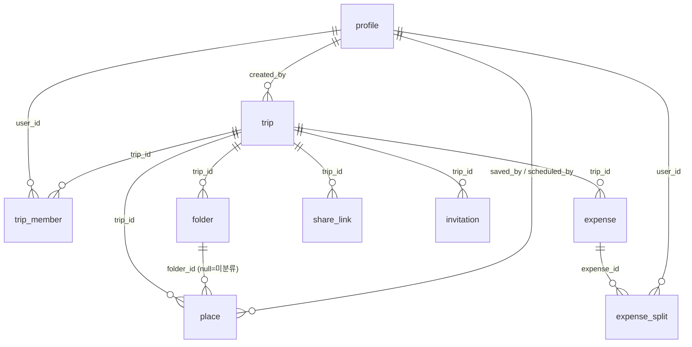

# 데이터 모델 · 계약 (단일 출처)

> 전 페이지(01~11) 공유 데이터 계약. **이 문서가 데이터의 단일 출처**다. Supabase(Postgres) 스키마 + RLS + 생성 타입 기준으로, 응답 타입을 화면마다 손으로 중복 정의하지 않는다(CLAUDE.md §7.2).
> GATE 1 승인 기획 + 설계 착수 시 확정한 교차 결정 4종을 반영한다.

## 0. 설계 착수 확정 (교차 결정)
| 항목 | 결정 | 영향 |
|---|---|---|
| **실시간 협업** | presence(접속) + 데이터 동기화. **실시간 커서는 후속** | Realtime 채널, presence는 비영속(아래 §8) |
| **카테고리** | **통합 단일 enum**(일정·지출 공용, 교통 포함) | `category` enum 단일 출처 |
| **통화** | 지출별 통화 입력 + **여행 기본 통화로 환산**(수동/고정 환율) | `expense.currency`+`fx_rate`+`amount_base`, `trip.base_currency` |
| **알림** | **설정 저장만**, 실제 발송은 후속 | `user.notif_*` 저장만, 발송 인프라 없음 |

## 1. 원칙
- **스택**: Supabase(Postgres + Auth + Realtime + Storage). 컬럼 `snake_case`, PK `uuid`(`gen_random_uuid()`), 시각 `timestamptz`.
- **타입**: Supabase 생성 타입(`Database`)을 단일 출처로 사용. 화면 응답 타입은 생성 타입에서 파생(중복 정의 금지).
- **상태 경계**(CLAUDE.md §7.1): 서버상태(아래 테이블) = TanStack Query, UI 상태(선택·필터·모드 등) = 로컬/Zustand. presence·커서 = Realtime.
- **보안**: 모든 접근은 **RLS로 멤버십·역할 강제**(§8.2). 공개 공유는 토큰 스코프(§6). UI 숨김은 보안이 아니다.

## 2. 엔티티 관계 (개요)
```
auth.users ──1:1── profile(사용자 프로필·환경설정)
                      │
profile ──*  trip_member  *── trip
                                 │
       ┌─────────────┬───────────┼───────────┬──────────────┐
     folder        place       expense    share_link    invitation
       │             │            │
       └──*  place  *┘     expense_split *── profile
(place: folder_id 저장 / scheduled_date 일정배정 — 한 엔티티)
template(정적 시드 3종) ──복제──> trip + place (여행 생성 시)
```

## 3. Enum (단일 출처)
```sql
-- 멤버 역할 (03·08·09·10 공유)
create type member_role as enum ('owner', 'editor', 'viewer');

-- 통합 카테고리 (04~07·10 공유) — 일정·지출 공용
create type category as enum (
  'food',       -- 식당/식비
  'cafe',       -- 카페
  'shopping',   -- 쇼핑
  'transport',  -- 교통
  'museum',     -- 명소
  'hotel',      -- 숙소
  'gift',       -- 기념품
  'etc'         -- 기타
);

-- 통화 (07·09·10) — 표시·환산 대상
create type currency as enum ('KRW', 'JPY', 'USD', 'EUR');

-- 여행 시작 방식 (03)
create type trip_start_mode as enum ('blank', 'template');

-- 공유 링크 권한 (10) — 편집 가능 / 읽기 전용
create type share_role as enum ('editor', 'viewer');

-- 초대 상태 (10)
create type invite_status as enum ('pending', 'accepted', 'revoked');
```
> 카테고리 **라벨·색·아이콘**은 DB가 아니라 프론트 단일 상수(`lib/constants/category.ts` + `@theme` 토큰)에서 enum 키에 매핑. 시안 라벨 불일치('식당/식비', '명소/명소·박물관')는 여기서 **단일 라벨로 통일**.

## 4. 테이블

### 4.1 `profile` (사용자 — 01·09)
| 컬럼 | 타입 | 비고 |
|---|---|---|
| `id` | uuid PK | `auth.users.id` 참조(1:1) |
| `name` | text not null | 멤버 목록·커서 표시명(09·04) |
| `email` | text not null | 로그인 이메일(읽기 전용, auth 동기화) |
| `avatar_color` | text not null | **멤버 식별 색**(04~08 커서·아바타 단일 소스) |
| `avatar_url` | text null | 프로필 이미지(업로드 — Storage) |
| `default_currency` | currency not null default `'KRW'` | 09 기본 통화 |
| `notif_trip` / `notif_comment` / `notif_settle` / `notif_marketing` | boolean default | 09 알림 토글 — **저장만**(발송 후속) |
| `created_at` | timestamptz default now() | |

### 4.2 `trip` (여행 — 02·03)
| 컬럼 | 타입 | 비고 |
|---|---|---|
| `id` | uuid PK | |
| `title` | text not null | |
| `cover_icon` | text not null | 아이콘 6종 키(03) |
| `cover_color` | text not null | 커버색 — 프리셋 5종 키 **또는 커스텀 hex**(F3, 예: `#7C5CFF`). resolver 가 키/hex 를 함께 해석(누락 시 기본색). 이미지 업로드 없음 |
| `country` / `region` | text null | 03 나라/지역 |
| `start_date` / `end_date` | date not null | **Day는 여기서 파생**(별도 테이블 없음) |
| `start_mode` | trip_start_mode | 03 빈/템플릿 |
| `base_currency` | currency not null default `'KRW'` | 정산·집계 기준 통화 |
| `total_budget` | numeric null | 07 예산 설정("남은 예산") |
| `created_by` | uuid → profile | 생성자(= 최초 owner) |
| `created_at` | timestamptz | |

### 4.3 `trip_member` (멤버십 — 02·03·08·10)
| 컬럼 | 타입 | 비고 |
|---|---|---|
| `id` | uuid PK | |
| `trip_id` | uuid → trip | |
| `user_id` | uuid → profile | |
| `role` | member_role not null | owner/editor/viewer |
| `joined_at` | timestamptz | |
| | | **unique(trip_id, user_id)**. owner는 trip당 최소 1 |
> 멤버 식별 색·표시명은 `profile`에서 조인(중복 저장 안 함). 접속 상태(online)는 **비영속 presence**(§8).

### 4.4 `folder` (장소 폴더 — 06·10)
| 컬럼 | 타입 | 비고 |
|---|---|---|
| `id` | uuid PK | |
| `trip_id` | uuid → trip | |
| `name` | text not null | 사용자 생성 컬렉션(맛집·가보고 싶은…) |
| `icon` / `color` | text | |
| `sort_order` | int | |
> 폴더 = **사용자 컬렉션**(카테고리 enum과 별개). "전체 장소"는 가상(folder_id 무관 전체).

### 4.4b `trip_city` (여행 도시 — 다중 도시, `0006`)
| 컬럼 | 타입 | 비고 |
|---|---|---|
| `id` | uuid PK | |
| `trip_id` | uuid → trip, cascade | |
| `name` | text not null | 도시명(예: 오사카) |
| `country` | text null | 국가 |
| `lat` / `lng` | numeric null | 도시 중심(지도 이동용, 선택) |
| `nights` | int not null | 박수 |
| `seq` | int not null | 여행 내 순서(0-based), `unique(trip_id, seq)` |
| `arrival_mode` | text null | 도착 이동 수단(다중 도시 Phase 5, `0007`) — `train`/`flight`/`bus`/`car`/`etc` |
| `arrival_name` | text null | 이동 이름(예: 신칸센 노조미), `0007` |
| `arrival_time` | time null | 출발/이동 시각(`HH:MM` 정규화), `0007` |
| `arrival_duration_min` | int null | 소요(분), `0007` |
| `created_at` | timestamptz | |
> **날짜는 저장 안 함** — `start_date` + 도시 `nights`·`seq` 로 파생(`citySchedule`, 단일 출처). 마지막 도시 endDate = 여행 end_date.
> **도시 간 이동(Phase 5, `0007`)**: `arrival_*` 는 non-first 도시(seq>0)에 부착 = "그 도시로 어떻게 왔는가". 경계일 = 도착 도시 첫날(startDate). 모두 nullable → 하위호환(기존·단일 도시엔 이동 없음).
> **하위호환**: 기존 여행은 백필로 도시 1개(seq 0, nights=여행 박수) 생성 → `cities.length===1` 이면 기존 단일 도시 UX 와 동일(도시 축 UI 미노출). RLS: select=`is_trip_member`, write=`trip_role in (owner,editor)`.

### 4.5 `place` (장소 — 04·05·06·10) ★ 저장 + 일정 단일 엔티티
| 컬럼 | 타입 | 비고 |
|---|---|---|
| `id` | uuid PK | |
| `trip_id` | uuid → trip | |
| `folder_id` | uuid → folder, null | 저장 위치(null=미분류) |
| `city_id` | uuid → trip_city, null | 소속 도시(다중 도시, `0006`). null=미배정. on delete set null |
| `name` | text not null | |
| `category` | category not null | 통합 enum |
| `area` | text null | 위치/지역(06) |
| `lat` / `lng` | numeric null | 좌표(Google Places) |
| `google_place_id` | text null | Places 연동 |
| `memo` | text null | **장소 메모 = 일정 메모 통일**(06 memo ↔ 04 note 단일화) |
| `saved_by` | uuid → profile | 저장한 멤버(06) |
| **`scheduled_date`** | date null | **일정 배정 시 날짜**(null=저장만). 04 "저장 장소" vs "일정 장소"의 단일 구분 |
| `order_in_day` | int null | 같은 날 순서(04 동선·드래그) |
| `start_time` | time null | 05 시각 |
| `duration_min` | int null | 05 소요 시간 |
| `scheduled_by` | uuid → profile, null | 일정에 추가한 멤버(05 "추가 · {멤버}") |
| `created_at` | timestamptz | |
> **핵심**: 저장 장소와 일정 장소는 **같은 행**. `scheduled_date` 유무로 구분(04 §13·06 §12 확정). 별도 테이블 금지.

### 4.6 `expense` (지출 — 07·10)
| 컬럼 | 타입 | 비고 |
|---|---|---|
| `id` | uuid PK | |
| `trip_id` | uuid → trip | |
| `title` | text not null | |
| `category` | category not null | 통합 enum(교통 포함) |
| `amount` | numeric not null | 입력 통화 기준 금액(>0) |
| `currency` | currency not null | 지출별 통화(10 KRW/JPY 등) |
| `fx_rate` | numeric not null default 1 | 입력 통화 → base_currency 환율. **사용자 입력 아님** — 지출 생성 시 `lib/constants` `FX_RATES`(base=KRW) 스냅샷 저장(이후 환율 변동 무관) |
| `amount_base` | numeric | `amount * fx_rate` (집계·정산 기준, 생성 칼럼 또는 셀렉터) |
| `payer_id` | uuid → profile | 결제자 1명(10) |
| `spent_on` | date | 지출 날짜(07 일자별 추이) |
| `created_by` | uuid → profile | |
| `created_at` | timestamptz | |

### 4.7 `expense_split` (분담 — 07·10)
| 컬럼 | 타입 | 비고 |
|---|---|---|
| `expense_id` | uuid → expense | |
| `user_id` | uuid → profile | 분담 멤버(다중) |
| | | **PK(expense_id, user_id)**. 1인당 = `amount_base / count`(균등). 분담 = **선택된 멤버 집합**(10 확정) |

### 4.8 `share_link` (공유 토큰 — 08·10)
| 컬럼 | 타입 | 비고 |
|---|---|---|
| `id` | uuid PK | |
| `trip_id` | uuid → trip | |
| `token` | text unique not null | **추측 불가**(고엔트로피) |
| `role` | share_role not null | editor/viewer(10) — 읽기 전용 링크 = 08 뷰어 |
| `expires_at` | timestamptz null | 만료(08 error) |
| `revoked` | boolean default false | 폐기 |
| `created_by` | uuid → profile | |

### 4.9 `invitation` (이메일 초대 — 10)
| 컬럼 | 타입 | 비고 |
|---|---|---|
| `id` | uuid PK | trip_id, email, role(editor/viewer), status(invite_status), invited_by |
| | | **발송은 후속**(알림 결정) — MVP는 초대 레코드 생성 + 링크 공유 중심(03 확정). `role` **기본 `editor`**(owner는 초대로 부여 불가), 서버 재검증(§8.2) |

### 4.10 `template` (정적 시드 — 03)
- 템플릿 3종은 **읽기 전용 시드 데이터**(앱 배포 시 주입). 여행 생성(`start_mode='template'`) 시 `trip` + `place` 다수로 **복제**. 사용자 템플릿 생성/관리 UI 없음(03 §12 확정).

## 5. 화면별 응답 예시 (테스트 fixture 재사용)
> 설계 fixture = QA 통합테스트의 입력(jero-qa-test 우선순위 ①). 생성 타입과 일치.

**02 내 여행 목록** — `useTripsQuery`
```jsonc
[{
  "id": "trip_1", "title": "도쿄, 우리끼리 4일",
  "cover_icon": "palmtree", "cover_color": "blue",
  "start_date": "2026-04-18", "end_date": "2026-04-21",
  "my_role": "owner",                 // trip_member 조인(현재 사용자)
  "member_avatars": [{"initial":"지","color":"#3B7DF0"}, /* …최대4 + +N */],
  "place_count": 17,
  "search_text": "도쿄, 우리끼리 4일 센소지 시부야 긴자 …",  // 제목 + 대표 장소명(서버 빌드, 소문자) — 02 "제목+장소" 클라 검색용
  "nights": 3, "days": 4, "dday": -120, "past": false   // 파생(서버 또는 셀렉터)
}]
```

**04 플랜 뷰 (선택 Day)** — `usePlacesQuery(trip_id, date)`
```jsonc
{
  "trip": {"id":"trip_1","title":"도쿄, 우리끼리 4일","start_date":"2026-04-18","end_date":"2026-04-21","my_role":"editor"},
  "places": [
    {"id":"p1","name":"츠키지 장외시장","category":"food","scheduled_date":"2026-04-18",
     "order_in_day":1,"start_time":"09:00","memo":"아침 스시","lat":35.66,"lng":139.77},
    {"id":"p2","name":"하마리큐 정원","category":"museum","scheduled_date":"2026-04-18","order_in_day":2,"start_time":"10:40"}
  ],
  "saved_places": [ {"id":"s1","name":"센소지","category":"museum","scheduled_date":null,"lat":35.71,"lng":139.79} ]
}
```

**07 예산** — `useBudgetQuery(trip_id)`
```jsonc
{
  "base_currency": "KRW", "total_budget": 1500000,
  "expenses": [
    {"id":"e1","title":"긴자 식스 쇼핑","category":"shopping","amount":152000,"currency":"KRW","fx_rate":1,"amount_base":152000,
     "payer_id":"u_seo","spent_on":"2026-04-18","split":["u_ji","u_seo"]}
  ],
  "metrics": {"total":1284000,"per_person":321000,"remaining":216000,"top_category":"hotel"},
  "by_category": [{"category":"hotel","amount_base":420000}],
  "by_day":      [{"date":"2026-04-18","amount_base":265000}],
  "settlements": [{"from":"u_do","to":"u_ji","amount_base":96000}],   // 서버 계산(§7)
  "settled_at": null
}
```

## 6. 권한 / RLS (요약)
| 작업 | owner | editor | viewer | 공개(토큰) |
|---|---|---|---|---|
| 여행·일정·장소 **조회** | ✅ | ✅ | ✅ | 토큰 스코프 읽기 |
| 장소·일정·지출 **편집** | ✅ | ✅ | ❌ | ❌ |
| 멤버 초대·역할 변경·제거, 링크 권한 | ✅ | ❌ | ❌ | ❌ |
| 여행 삭제·예산 설정 | ✅ | ❌ | ❌ | ❌ |
- RLS: 모든 `trip` 하위 테이블은 `trip_member`에 현재 사용자가 있고 역할이 충분할 때만 접근. 편집 계열은 `role in ('owner','editor')`, 관리 계열은 `role='owner'`.
- **공개 공유**(08): 세션이 아니라 **토큰**으로 읽기 전용 스코프. 응답에서 **이메일·예산/정산·내부 ID 제외**(§8.5). 별도 보안 뷰/RPC로 제공.
- 비로그인 보호 라우트 → 01 로그인 리다이렉트(시스템 페이지 아님). 비멤버 접근 → 403(11 §13 정책 채택: 인증 사용자에게 403, 단 민감 리소스는 404 — 구현 시 확정).

## 7. 계산 규칙 (서버)
- **파생 지표**(02 nights/dday, 07 metrics): 가능하면 서버 계산 또는 순수 셀렉터(`lib`). `dday`/`past`는 **여행 현지 기준 날짜**로(타임존 §9).
- **환산(입력 시점 고정환율 스냅샷)**: 지출 생성 시 `lib/constants` `FX_RATES`(base=KRW)에서 통화별 환율을 읽어 `fx_rate`로 **스냅샷 저장**(사용자 입력 아님, 이후 환율 변동 무관). `amount_base = amount * fx_rate`(같은 통화면 1). 집계·정산은 `amount_base`(=KRW base) 기준. **실시간 환율 API는 phase 2**.
- **정산**(07): 결제자 `payer_id` + 분담 `expense_split`에서 멤버별 순채무 산출 → **송금 건수 최소화**(그리디) → `{from,to,amount_base}` 목록. `settled_at`로 정산 완료 표시.
  - **구현 결정(2단계)**: metrics·byCategory·byDay·settlements는 **MVP=클라 순수 셀렉터**(`lib/budget.ts`)로 계산·표시한다(useBudgetQuery는 원천 expense/split만 반환). 규모·부하가 커지면 **서버 RPC로 승격**(권위·성능, §8.3). fx_rate 스냅샷·amount_base(생성 칼럼)는 이미 서버 저장.

## 8. 실시간 (presence) — 비영속
- Supabase Realtime **presence 채널**(trip 단위)로 "접속 중 멤버"(04~07 헤더) 표시. DB 테이블 아님.
- 장소·일정·지출 변경은 `postgres_changes` 구독으로 동기화 → TanStack Query 캐시 무효화.
- **실시간 커서는 MVP 제외**(후속). 시안의 커서 UI는 구현 보류 — 화면엔 presence(접속 점)만 동작.

## 9. 해소된 열린 질문 + 남은 기술 항목
**이 문서에서 확정(해소):**
- 카테고리 통합 단일 enum / 통화 지출별+환산 / 알림 저장만 / 실시간 presence+동기화(커서 후속)
- `memo`=`note` 통일(place.memo) · `saved_by`/`scheduled_by` 둘 다 보유 · Place 단일 엔티티(저장+일정) · 역할 3종 단일 정의
- 공유 링크 권한 2종(editor/viewer), 읽기 전용=08 뷰어 · 커버 이미지 없음(색·아이콘만)
- **통화 환산 = 입력 시점 고정환율 스냅샷**(`FX_RATES` base=KRW → `expense.fx_rate` 자동, 실시간 API는 phase 2) · **초대 역할 기본 `editor`**(owner 부여 불가, 멤버 목록에서 변경) · **삭제 확인은 `components/ui/ConfirmDialog` 공유**(장소·지출·멤버·계정)

**프론트 설계(②)·구현에서 다룰 항목:**
- 타임존 기준(현지 vs 로컬) 최종 적용 위치, 캘린더 임의 연·월 범위
- Google Places 연동 상세(검색·자동완성·place_id 저장 흐름)
- 원본 통화 병기 표시 여부(`amount_base` + 원통화), 09 기본통화 4종 표시·선택 범위
- 403 vs 404 세부 정책, 토큰 만료 기본값, 초대 발송(후속) 트리거
- 드래그 시간 변경(05), 동선 거리(04) — 후속 후보

## 10. GATE 2 (설계 승인)
- **상태: ✅ 승인 완료 (2026-06-24)** — ① 데이터모델_계약 + ② 7개(auth/trips/workspace/share/account/overlays/system).
- 검토: workspace·overlays·trips·auth·share·system 깊이 검토 완료, account 연동 반영. 교차 결정(B/C/D)·F1(검색 텍스트)·F2(라우트 그룹)·map `components/` 승격 반영.
- **다음: 구현(`/jero구현`)** — 이 계약·설계를 기준으로 `src/` 구현. 공통(디자인 토큰·`components/ui`·`components/map`·`lib`) 먼저, 이후 화면.

---

# Part B — Supabase 백엔드 연동 설계 (증분 · GATE 2 대상)

> 프론트(01~11) 구현·배포 완료 후, 계약 우선 seam(스텁)을 실제 Supabase로 잇는 설계다. **§0~§10의 스키마·enum·권한 요약이 여전히 단일 출처**이며, 여기서는 그것을 실행 가능한 형태(DDL·RLS SQL·Auth·Realtime·seam 매핑·환경·마이그레이션)로 구체화한다. 별도 backend-design/migration 문서를 만들지 않고 이 문서에 통합한다(하네스 규약).
> **원칙 불변**: 계약 = Supabase 스키마 + 생성 타입(§7.2). 권한은 항상 서버/RLS(§8.2). 응답 타입 손수 중복 정의 금지.

## B1. DB 스키마 확정 + 생성 타입

- **테이블**(§4 그대로): `profile`, `trip`, `trip_member`, `folder`, `place`(저장+일정 단일 엔티티, `scheduled_date`/`order_in_day`), `expense`(+`fx_rate` 스냅샷·`amount_base`), `expense_split`, `share_link`, `invitation`, `template`(정적 시드). enum은 §3.
- **키·규약**: PK `uuid default gen_random_uuid()`, 시각 `timestamptz default now()`, 컬럼 `snake_case`, 모든 `trip` 하위 테이블에 `trip_id` FK(`on delete cascade`). `place`·`expense`의 날짜/시각은 **여행 현지 기준**이라 `date`/`time`(타임존 없는 타입)으로 저장(B9 시간 처리).
- **`amount_base`**: `generated always as (amount * fx_rate) stored` 생성 칼럼(집계·정산 일관).
- **`expense_split`의 trip 판정 [C 확정]**: `trip_id`를 **비정규화하지 않는다**(동기화 드리프트 방지). RLS는 parent `expense` 조인으로 멤버십/역할을 판정한다(B2). PK는 `(expense_id, user_id)` 그대로.
- **부트스트랩 쓰기**: 여행 생성(owner 멤버십)·초대 수락(비멤버→멤버)은 RLS의 self-insert로 표현하기 까다로워 **`security definer` RPC 2개**(`create_trip`·`accept_invite`, B2.1)로 처리한다.
- **ERD (관계)**:


```mermaid
erDiagram
  profile ||--o{ trip_member : "user_id"
  trip    ||--o{ trip_member : "trip_id"
  profile ||--o{ trip : "created_by"
  trip    ||--o{ folder : "trip_id"
  trip    ||--o{ place : "trip_id"
  folder  ||--o{ place : "folder_id (null=미분류)"
  trip    ||--o{ expense : "trip_id"
  expense ||--o{ expense_split : "expense_id"
  profile ||--o{ expense_split : "user_id"
  trip    ||--o{ share_link : "trip_id"
  trip    ||--o{ invitation : "trip_id"
  place   }o--|| profile : "saved_by / scheduled_by"
```

- **생성 타입 방침**: 스키마는 `supabase/migrations/*.sql`로 관리하고, 타입은
  `supabase gen types typescript --project-id <id> --schema public > src/types/database.types.ts` 로 생성.
  `Database` 타입에서 화면 DTO를 **파생**한다(예: `type PlaceRow = Database['public']['Tables']['place']['Row']`). 현재 `src/features/*/types.ts`의 손수 정의 DTO는 **생성 타입에서 좁힌 파생으로 교체**(§7.2). 응답 예시(§5)는 생성 타입과 일치해야 하며 테스트 fixture로 계속 재사용.

## B2. RLS 정책 (§8.2 핵심 — 행 단위 강제)

모든 테이블 `enable row level security`. 접근 판정은 **"요청자가 해당 trip의 멤버인가 + 역할이 충분한가"**. 반복을 줄이기 위해 `security definer` 헬퍼 두 개로 통일:

```sql
-- 현재 사용자가 이 trip의 멤버인가
create or replace function public.is_trip_member(t uuid)
returns boolean language sql security definer stable as $$
  select exists (
    select 1 from public.trip_member m
    where m.trip_id = t and m.user_id = auth.uid()
  );
$$;

-- 현재 사용자의 이 trip 역할 (없으면 null)
create or replace function public.trip_role(t uuid)
returns member_role language sql security definer stable as $$
  select m.role from public.trip_member m
  where m.trip_id = t and m.user_id = auth.uid();
$$;
```

정책 패턴(예시 — 나머지 trip 하위 테이블 동일 적용):

```sql
-- profile: 본인 + 같은 trip 멤버는 조회(멤버 목록·커서 표시), 수정은 본인만
create policy profile_select on public.profile for select
  using ( id = auth.uid()
       or exists (select 1 from public.trip_member a
                  join public.trip_member b on a.trip_id = b.trip_id
                  where a.user_id = auth.uid() and b.user_id = profile.id) );
create policy profile_update on public.profile for update using ( id = auth.uid() );

-- trip: 멤버만 조회 / owner만 수정·삭제. **직접 INSERT 정책 없음** — 생성은 create_trip RPC(B2.1)로만.
create policy trip_select on public.trip for select using ( public.is_trip_member(id) );
create policy trip_update on public.trip for update using ( public.trip_role(id) = 'owner' );
create policy trip_delete on public.trip for delete using ( public.trip_role(id) = 'owner' );

-- place·folder·expense: 멤버 조회 / editor+ 편집 (folder·expense 동일 패턴)
create policy place_select on public.place for select using ( public.is_trip_member(trip_id) );
create policy place_write  on public.place for all
  using  ( public.trip_role(trip_id) in ('owner','editor') )
  with check ( public.trip_role(trip_id) in ('owner','editor') );

-- expense_split [C]: trip_id 비정규화 없이 parent expense 조인으로 판정
create policy split_select on public.expense_split for select
  using ( public.is_trip_member((select e.trip_id from public.expense e where e.id = expense_id)) );
create policy split_write on public.expense_split for all
  using      ( public.trip_role((select e.trip_id from public.expense e where e.id = expense_id)) in ('owner','editor') )
  with check ( public.trip_role((select e.trip_id from public.expense e where e.id = expense_id)) in ('owner','editor') );

-- trip_member: 멤버 조회 / owner만 관리(초대·역할변경·제거).
-- **비멤버의 self-insert 정책 없음** — 초대 수락은 accept_invite RPC(B2.1)로만.
create policy member_select on public.trip_member for select using ( public.is_trip_member(trip_id) );
create policy member_manage on public.trip_member for all
  using ( public.trip_role(trip_id) = 'owner' ) with check ( public.trip_role(trip_id) = 'owner' );
```

- **역할 매트릭스는 §6 그대로**: 조회=멤버 전원 / 편집(place·expense·folder)=`owner|editor` / 관리(멤버·링크·예산·여행삭제)=`owner`.
- **공개 공유(08)는 RLS 우회가 아니라 별도 경로**: 세션 없는 익명 요청은 어떤 테이블도 직접 못 읽는다. `share_link` 토큰 검증 + 민감필드 제외 스냅샷을 반환하는 **`security definer` RPC**로만 제공(B6). 토큰은 읽기 스코프(`viewer`) + `expires_at` 만료 + `revoked` 폐기.
- **애플리케이션 이중화**: 서버(라우트 핸들러/서버 액션)에서도 세션·역할을 재확인(§8.2). RLS는 최후 방어선이지 유일 방어선이 아니다.

### B2.1 멤버십 부트스트랩 RPC (`security definer`)

RLS만으로 표현하기 까다로운 **두 개의 쓰기**는 `security definer` RPC로 한 트랜잭션에 처리한다(정의자 권한으로 실행되므로 위 owner-only 정책의 닭-달걀을 우회하되, **함수 내부에서 자격을 직접 검증**한다).

```sql
-- [A] 여행 생성 — trip + owner 멤버십(+ 템플릿 복제)을 원자적으로. RLS trip INSERT 정책 불필요.
create or replace function public.create_trip(payload jsonb)
returns uuid language plpgsql security definer as $$
declare new_id uuid;
begin
  if auth.uid() is null then raise exception 'unauthenticated'; end if;   -- 로그인 필수
  insert into public.trip (title, cover_icon, cover_color, country, region,
                           start_date, end_date, start_mode, base_currency, created_by)
  select payload->>'title', payload->>'cover_icon', payload->>'cover_color',
         payload->>'country', payload->>'region',
         (payload->>'start_date')::date, (payload->>'end_date')::date,
         (payload->>'start_mode')::trip_start_mode,
         coalesce((payload->>'base_currency')::currency,'KRW'), auth.uid()
  returning id into new_id;
  insert into public.trip_member (trip_id, user_id, role) values (new_id, auth.uid(), 'owner');
  -- start_mode='template' 이면 template → place 복제(같은 트랜잭션).
  return new_id;
end; $$;

-- [B] 초대 수락 — 비멤버가 유효 토큰으로 스스로 멤버가 되는 유일 경로.
create or replace function public.accept_invite(invite_token text)
returns uuid language plpgsql security definer as $$
declare inv public.invitation;
begin
  if auth.uid() is null then raise exception 'unauthenticated'; end if;
  select * into inv from public.invitation
    where token = invite_token and status = 'pending'
      and (expires_at is null or expires_at > now());
  if not found then raise exception 'invalid_or_expired_invite'; end if;
  -- MVP: bearer 토큰(유효 링크 소지자면 수락). TODO(후속): 초대 이메일 == 로그인 이메일 바인딩 검증.
  insert into public.trip_member (trip_id, user_id, role)
    values (inv.trip_id, auth.uid(), inv.role)
    on conflict (trip_id, user_id) do nothing;           -- 이미 멤버면 무해
  update public.invitation set status = 'accepted' where id = inv.id;   -- 초대 소비
  return inv.trip_id;
end; $$;
```

- **`create_trip`**: `useCreateTrip`이 이 RPC를 호출(B5). owner 역할은 초대가 아니라 **생성으로만** 부여(§4.9). `owner`는 trip당 최소 1 보장.
- **`accept_invite`**: 초대 수락 전용 경로. **발급(`useShareActions`)과 분리**된 "수락" 훅으로 노출(B5). `invitation`은 발송 후속이라 MVP는 초대 레코드 + 링크 공유(`/invite/[token]`) 중심 — 로그인 후 이 RPC 호출 → 멤버 전환. **MVP 수락 = bearer 토큰**(유효 링크 소지자면 수락); **초대 이메일 바인딩**(수락자 이메일 == 초대 이메일)은 이메일 발송 인프라와 함께 후속.
- 두 RPC 모두 **입력을 서버에서 재검증**(§8.3)하고, 정의자 권한이지만 `auth.uid()`·토큰 유효성으로 자격을 직접 검사해 남용을 막는다.

## B3. 인증 (Supabase Auth)

- **방식**: 이메일+비밀번호 / **Google OAuth**(`supabase.auth.signInWithOAuth({ provider:'google', options:{ redirectTo: <origin>/auth/callback }})`). `useAuth`의 `login/signup/googleLogin` 스텁을 이걸로 교체.
- **SSR 세션**: `@supabase/ssr`의 `createServerClient`(RSC·라우트·미들웨어) / `createBrowserClient`(클라). 세션은 **서버 발급 쿠키 — `HttpOnly` + `Secure` + `SameSite=Lax`**(§8.4). **토큰을 `localStorage`에 저장 금지.**
- **콜백 라우트**: `app/auth/callback/route.ts`(신규, 구현 단계)에서 `exchangeCodeForSession` 후 원래 목적지로 리다이렉트.
- **미들웨어 보호**(`middleware.ts`, 신규): 매 요청 세션 갱신 + 보호 라우트 가드.
  - 보호: `/trips`, `/trips/:path*`, `/settings` → **미인증 시 `/`(로그인)로 리다이렉트**(시스템 페이지 아님, §6).
  - 공개: `/`(로그인), `/share/:token`(토큰 스코프), `/auth/callback`.
- **서버 세션 검증**: 보호 라우트의 RSC/서버 액션/뮤테이션은 **`auth.getUser()`로 서버에서 세션을 검증**한 뒤 수행. 클라가 보낸 역할/소유를 신뢰하지 않는다(§8.2).
- **profile 프로비저닝**: 최초 로그인 시 `auth.users` insert 트리거(또는 콜백에서 upsert)로 `profile` 행 생성. **`avatar_color`는 `lib/constants/members.ts`의 `MEMBER_COLORS` 팔레트에서 랜덤 배정**(멤버 식별 색 단일 소스 — 04~08 커서·아바타 공유). `name`은 OAuth 프로필명 또는 이메일 로컬파트 기본값.
- **비밀번호 정책 [확정]**: **가입·재설정은 `min 8`**(기획 13·시안 일치). **로그인은 하드 min 없이 "필수"만** 검증(길이 규칙 강화 이전에 만든 짧은 비밀번호 계정의 로그인 거부 방지). `authSchema`(min 6 → 로그인/가입 분리) 코드 반영은 **구현 1단계**.
- **로그아웃/탈퇴**: `useLogout`→`supabase.auth.signOut()`. `useDeleteAccount`→서버 라우트에서 재인증 확인 후 소유 trip 처리(위임 또는 삭제) + `auth.admin.deleteUser`(service role, 서버 전용).

## B4. 실시간 (Realtime)

- **접근 제어 [D]**: 채널은 **private**로 열고 **Realtime Authorization**을 적용한다 — `realtime.messages`(topic=`trip:<id>`)에 대한 RLS 정책으로 **해당 trip 멤버만 구독**하게 강제(비멤버·익명 broadcast/presence 구독 차단, §8.2 연결). `postgres_changes`는 소스 테이블(`place`·`expense`·`expense_split`·`trip_member`)의 **RLS를 준수**해 요청자가 볼 수 있는 행만 전달된다. 즉 실시간도 세션·멤버십으로 게이트된다.

  ```sql
  -- realtime.messages: 이 topic(trip:<id>)의 멤버만 read/write 허용
  create policy rt_trip_member on realtime.messages for select
    using ( public.is_trip_member( (split_part(realtime.topic(), ':', 2))::uuid ) );
  ```
- **presence(비영속)**: `supabase.channel('trip:'+tripId, { config:{ presence:{ key: myUserId }}})` → `track({ online })`로 접속 표시(04~07 헤더 "접속 중"). **실시간 커서는 후속**(§8) — presence payload에 `lat/lng`를 얹으면 `useMockCursors`를 그대로 대체할 수 있게 인터페이스는 이미 맞춰둠(`LiveCursor`).
- **데이터 동기화**: 같은 채널에서 `postgres_changes`(`event:'*'`, `schema:'public'`, `table in place|expense|expense_split|trip_member`, `filter: trip_id=eq.<id>`) 구독 → 변경 수신 시 해당 쿼리 `invalidate`(`['places',id]`·`['budget',id]`·`['members',id]`).
- **낙관적 업데이트 ↔ 실시간 reconciliation**(§13 확정): 드래그·일정에 추가 등 낙관적 뮤테이션이 **in-flight인 동안**에는 해당 쿼리의 `postgres_changes` invalidate를 **디바운스/무시**해 깜빡임·되감김을 막고, 뮤테이션 `settle` 직후 한 번 재동기화한다.
- **충돌 처리**: **last-write-wins**(데이터 계약 §8). 순서 재정렬은 그 날 전체 `order_in_day` 배열을 한 번에 저장하는 방식(B5)이라 마지막 저장이 승리 — 부분 병합으로 인한 꼬임 없음. 동시 편집 경합은 MVP 범위에서 LWW로 수용.

## B5. seam → 실구현 매핑 (무효화 키 유지)

> **훅 시그니처·쿼리 키·무효화 키는 기존 그대로.** `queryFn`/`mutationFn` 내부만 fixture/stub → Supabase 호출로 교체한다(컴포넌트 코드 무변경, §7.1). Supabase 클라는 `lib/supabase/{client,server}.ts`(신규)에서 주입.

| seam 훅 | 종류 | 쿼리/무효화 키 | 실구현 (Supabase) |
|---|---|---|---|
| `useAuth` (login/signup/googleLogin) | mutation | — | `auth.signInWithPassword` / `auth.signUp` / `auth.signInWithOAuth({provider:'google'})` |
| `useLogout` | mutation | — | `auth.signOut()` + 캐시 클리어 |
| `useProfileQuery` | query | `['profile']` | `profile` select (본인) |
| `useUpdateProfile` | mutation | inv `['profile']` | `profile` update(본인) — 서버 Zod 재검증 |
| `useDeleteAccount` | mutation | — | 서버 라우트: 소유 trip 위임/삭제 → `auth.admin.deleteUser`(service role) |
| `useTripsQuery` | query | `['trips']` | `trip` + `trip_member`(내 role) + 대표 장소/카운트 조인(뷰 또는 RPC), `search_text`·`nights`·`dday` 서버 파생 |
| `useTripQuery` | query | `['trip', id]` | `trip` 단건(RLS) |
| `useCreateTrip` | mutation | inv `['trips']` | **`rpc('create_trip', payload)`**(B2.1) — trip + owner 멤버십(+템플릿 복제) 원자적. 반환 `trip_id`로 워크스페이스 이동 |
| `usePlacesQuery` | query | `['places', id]` | `place`(trip_id) select — `scheduled_date` 유무로 일정/저장 구분(§4.5) + `trip` 메타 |
| `useMembersQuery` | query | `['members', id]` | `trip_member` ⨝ `profile`(표시명·색·role). `online`은 presence(B4) |
| `useUpsertPlace` / `useDeletePlace` | mutation | inv `['places', id]` | `place` insert/update / delete (editor+). place_id·lat/lng는 Places 선택 시 저장(B9) |
| `useAddPlaceToSchedule` | mutation | inv `['places', id]` | `place` update `scheduled_date`+`order_in_day`(말미)+`scheduled_by` |
| `useReorderPlaces` | mutation(낙관적) | setQueryData `['places', id]` | 그 날 `order_in_day` 배열 **일괄 upsert RPC**(`reorder_places(trip_id, date, ordered_ids[])`). onMutate 낙관 유지, `onSettled` invalidate(현재 스텁의 "invalidate 안 함"은 실연동 시 해제) |
| `useBudgetQuery` | query | `['budget', id]` | `expense` ⨝ `expense_split` + `metrics`·`by_category`·`by_day`·`settlements` **서버 계산 RPC**(§7) |
| `useUpsertExpense` (`useExpenseActions`) | mutation | inv `['budget', id]` | `expense` insert/update + `expense_split` 재작성; `fx_rate` 스냅샷 서버에서 부여(§7) |
| `markSettled` (`useExpenseActions`) | mutation | inv `['budget', id]` | `trip.settled_at`(또는 정산 레코드) 갱신 — owner |
| `useShareActions` | mutation | inv `['members', id]` | (발급 측) 초대(`invitation` insert)·역할 변경(`trip_member` update)·멤버 제거·`share_link` 발급/폐기 — **owner, 서버 재확인** |
| `useAcceptInvite` *(신규)* | mutation | inv `['trips']`, `['members', id]` | **`rpc('accept_invite', {token})`**(B2.1) — 비멤버가 유효 초대로 멤버 전환 + 초대 소비. 진입: `/invite/[token]` → 로그인 후 호출 → 워크스페이스 이동 |
| `useSharedTripQuery` | query | `['share', token]` | **익명** `get_shared_trip(token)` RPC(B6) — 세션 무관, 민감필드 제외 |
| `useSeedTripDetails` | (데모 프리페치 헬퍼) | `['trip', id]` 시드 | 실연동 시 제거 또는 `prefetchQuery`로 대체 |

## B6. 서버 검증 · 신뢰 경계 · 민감필드 (§8.3·§8.5)

- **서버측 Zod 재검증**: 클라 검증(`authSchema`·`placeSchema`·`expenseSchema`·`tripSchema`·`profileSchema`)은 UX용. **신뢰 경계는 서버** — 라우트 핸들러/서버 액션에서 **동일 스키마로 모든 입력을 재검증**(§8.3). 스키마는 `features/*/lib/*Schema.ts`를 서버에서 재사용(단일 출처).
- **공개 스냅샷(08)**: `get_shared_trip(token)`는 `security definer`로 토큰 유효(미만료·미폐기)만 통과시키고 **`trip`(title/기간) + `place`(name·category·scheduled_date·order_in_day·start_time·memo·lat·lng) + `member`(표시명·색)만** 반환. **이메일·예산/정산·내부 ID·`saved_by`/`created_by` 제외**(§8.5). 뮤테이션 없음.
- **에러·로깅**: 인증 실패는 일반화 메시지(계정 존재 여부 비노출), 시크릿·토큰·PII 로깅 금지(§8.5). 초대·링크 발급·인증 시도 rate limit 고려(§8.7).

## B7. 환경변수

| 변수 | 노출 | 용도 |
|---|---|---|
| `NEXT_PUBLIC_SUPABASE_URL` | 클라 | Supabase 프로젝트 URL |
| `NEXT_PUBLIC_SUPABASE_ANON_KEY` | 클라 | anon 키(RLS 전제로 노출 허용) |
| `SUPABASE_SERVICE_ROLE_KEY` | **서버 전용** | 계정 삭제 등 관리 작업. **절대 `NEXT_PUBLIC_` 금지**, 클라 번들 유입 금지(§8.1) |

- `.env.example`에 위 세 개 주석 예시 추가(구현 단계). `.env*`는 커밋 금지(이미 `.gitignore`). 기존 `NEXT_PUBLIC_GOOGLE_MAPS_API_KEY[+MAP_ID]`는 그대로.

## B8. 마이그레이션 · 시드 · 롤아웃

- **스키마 마이그레이션**: `supabase/migrations/*.sql`(enum→테이블→RLS→헬퍼→RPC 순). 적용 후 생성 타입 재생성(B1).
- **시드**: 현재 fixture(`features/*/api/fixtures.ts`)의 도쿄 데모 여행을 `supabase/seed.sql`로 이관 — 데모 계정 1개 + trip_1 + 멤버/장소/지출. **fixture는 테스트에서 계속 사용**(계약 예시 = 테스트 입력).
- **계정 삭제 시 소유권 승계**: `useDeleteAccount`는 사용자가 **유일 owner인 trip**에 대해 다른 멤버(가장 오래 참여한 editor→그다음)에게 owner를 승계하고, 멤버가 자신뿐이면 trip+하위 데이터를 cascade 삭제한 뒤 `auth.admin.deleteUser`(service role). 데이터 고아·owner 부재 방지.
- **단계별 롤아웃(각 단계 배포 가능)** — 사용자 요청 #9:
  1. **인증 먼저** — Supabase Auth + 미들웨어 + 콜백 + profile 프로비저닝. 로그인/구글/로그아웃 실동작, 보호 라우트 가드. 데이터는 아직 fixture여도 됨(로그인만 실연동).
  2. **데이터 CRUD** — `trip`/`place`/`folder`/`expense` 쿼리·뮤테이션을 seam 내부에서 Supabase로 교체(무효화 키 유지). RLS 적용. 공유 RPC(08).
  3. **실시간** — presence(접속) + `postgres_changes` 동기화 + 낙관적 reconciliation. (커서는 후속.)
  - 각 단계 후 `yarn run check` + 핵심 플로우 e2e + `yarn build` 그린 유지.

## B9. 열린 질문 확정 (기존 §13/§9 잔여)

| 질문 | 확정 |
|---|---|
| **실시간 범위** | presence(접속)만 MVP, `postgres_changes`로 데이터 동기화. **실시간 커서는 후속**(인터페이스는 `LiveCursor`로 준비됨). |
| **place_id 저장 · Places 과금** | Google Cloud에서 **Places API 활성화** + 키에 HTTP referrer·API 범위 제한(§8.1). Places **Autocomplete는 세션 토큰**으로 요청을 묶어 과금 최적화, 선택 시 `google_place_id` + `lat`/`lng` + `name` 저장. 좌표 없는 수기 장소도 허용(지도에서 제외). |
| **시간 처리** | **여행 현지 기준으로 통일**. `place.scheduled_date`/`start_time`은 `date`/`time`(타임존 없는 값)로 저장, `dday`·캘린더는 여행 현지 날짜 기준으로 서버/순수 셀렉터 계산(클라 로컬 타임존 영향 배제 — 현행 `parseDate`(UTC 자정) 방식 유지). |
| **저장 ↔ 일정 배정** | `place` **단일 엔티티**. `scheduled_date=null`=저장만, `date`=일정. 배정=`useAddPlaceToSchedule`(update), 해제=`scheduled_date=null`. |
| **날짜별 빈 상태** | 해당 Day에 `scheduled_date` 매칭 place가 0이면 좌측 CTA + 지도 안내 오버레이(04 수용기준). 서버 필터/셀렉터로 판정. |
| 403 vs 404 | 비멤버 접근은 인증 사용자에 **403**(11 정책), 단 존재 비노출이 필요한 민감 리소스는 404 — 구현 시 라우트별 확정. |
| 토큰 만료 기본값 | `share_link.expires_at` 기본 **30일**(발급 시 설정, 재발급 가능). NULL=무기한(옵션). |

## B10. GATE 2 (백엔드 연동 설계) — ✅ 승인 완료
- **상태: ✅ 승인 완료 (2026-07-02)** — B1~B9(스키마·RLS·Auth·Realtime·seam 매핑·서버검증·환경·마이그레이션/롤아웃·열린질문 확정).
- **검토 반영·확정**: [A] `create_trip` RPC(owner 부트스트랩 닭-달걀 해소, trip 직접 INSERT 정책 제거) · [B] `accept_invite` RPC + `useAcceptInvite` 경로 — **MVP bearer 토큰 수락**(이메일 바인딩 후속) · [C] `expense_split`은 trip_id 비정규화 없이 parent expense 조인 RLS · [D] Realtime private 채널 + Authorization(비멤버 구독 차단, postgres_changes는 테이블 RLS 준수) · 경미(avatar_color=MEMBER_COLORS 랜덤 · 계정삭제 owner 승계 · Places API 활성화/세션토큰 과금) · **비밀번호 min 8 통일(로그인은 필수만)**.
- **다음: 구현(`/jero구현`)** — 롤아웃 순서(B8) ①인증 → ②데이터 CRUD → ③실시간. 각 단계 배포 가능·`yarn run check`/`build` 그린 유지.
- 범위: 이 문서(단일 출처) 증분만 수정. `src/`·설정·`docs/spec`·`docs/design` 무변경(하네스 준수). 프론트 설계(②)는 seam 시그니처가 불변이라 재작성 불필요 — 각 `*_frontend.md`의 "쿼리·뮤테이션 매핑"은 B5 표로 실구현이 확정됨.
- **승인 시 다음**: 구현(`/jero구현`) — 롤아웃 순서(B8) 대로 ①인증 → ②데이터 CRUD → ③실시간. 각 단계 배포 가능.

---

# Part C — AI 어시스턴트 데이터 계약 (증분 · GATE 2 대상)

> 기획 `docs/planning/18_AI_여행_어시스턴트.md`, 설계 `docs/architecture/AI_어시스턴트_설계.md` 의 **데이터 계약 증분**.
> **§0~§10 + Part B 가 여전히 단일 출처**이며, 여기서는 어시스턴트가 추가하는 것만 정의한다: 임베딩 테이블 1개, 사용량 테이블 1개, RPC 3개.
> **원칙 불변**: 권한은 RLS 로 행 단위 강제(§8.2) · 응답 타입 손수 중복 정의 금지(§7.2) · 기존 테이블·정책 **무변경**(additive).

## C0. 확정 결정 (GATE 2 검토 반영)

| # | 항목 | 결정 | 근거 |
|---|---|---|---|
| **C1** | **임베딩 쓰기 경로** | **`security definer` RPC `upsert_place_embedding` 단독**. 클라이언트 직접 INSERT/UPDATE **정책 없음** | 아래 §C1 |
| **C2** | **임베딩 provider · 차원** | **Gemini `gemini-embedding-001`, `outputDimensionality=768`** (+ 절단 후 L2 정규화) → `vector(768)` | 아래 §C2 |
| **C3** | **벡터 인덱스** | **ANN 인덱스 없음(정확 검색) + `btree(trip_id)`**. 임계치 초과 시 HNSW 승격 | 아래 §C3 |
| **C4** | **사용량(rate limit)** | `assistant_usage` + **`security definer` RPC `consume_assistant_quota`**. 클라 쓰기 정책 없음 | 아래 §C6 |
| **C5** | **대화 로그** | **DB 미저장(비영속)** — 테이블 없음 | PII·보관정책 리스크 회피(§8.5). 영속화는 후속 |

### C1. 임베딩 쓰기 RLS — `security definer` RPC 채택 (★수정1)

**문제**: 직전 설계는 `place_embedding` 에 select 정책만 두고 "쓰기는 서버만"이라고 적었는데, **RLS 는 정책이 없으면 거부**이므로 서버가 사용자 세션 클라이언트로 쓰는 순간 **인덱싱이 통째로 실패**한다(어시스턴트가 `service_role` 을 쓰지 않기로 했으므로, §8 설계). 즉 "구멍"이 아니라 **쓰기 경로 자체가 없는 상태**였다.

**두 안 비교**

| | (A) `editor+` 직접 쓰기 정책 | **(B) `security definer` RPC** ✅ |
|---|---|---|
| viewer 가 인덱싱 트리거 | ❌ 불가 (viewer 만 접속한 여행은 RAG 영구 공백) | ✅ 가능(멤버면 OK) |
| `trip_id` 스푸핑 | ⚠️ 가능 — 자신이 editor 인 trip 의 `trip_id` 로 **남의 place_id** 행을 만들 수 있음 | ✅ 불가 — `trip_id`·`content` 를 **place 행에서 서버가 파생** |
| `content` 위조(RAG 오염) | ⚠️ 임의 텍스트 주입 가능(프롬프트 인젝션 벡터) | ✅ 불가 — 함수가 place 컬럼으로 재구성 |
| 기존 프로젝트 관례 | — | ✅ `create_trip`·`accept_invite` 와 동일 패턴(B2.1) |

**결정: (B)**. 호출자는 `place_id` 와 벡터만 넘기고, **`trip_id`·`content` 는 함수가 `place` 행에서 직접 읽어 채운다** → 클라이언트가 조작할 수 있는 필드가 사라진다.

#### C1-a. 자가 인가(self-authorization) — definer 함수의 **필수** 요건

`security definer` 는 **RLS 를 우회**한다. 따라서 이 함수는 RLS 가 해주던 판정을 **스스로** 해야 하며, 그 판정은 **클라이언트 입력이 아니라 DB 에서 조회한 값**을 근거로 해야 한다. 세 가지를 모두 만족시킨다(C5·C8 SQL 반영):

```sql
if auth.uid() is null then raise exception 'unauthenticated'; end if;   -- ① 로그인 확인

select * into p from public.place where id = p_place_id;                -- ② 대상 행을 DB 에서 조회
if not found then raise exception 'place_not_found'; end if;

if not public.is_trip_member(p.trip_id) then                            -- ③ 조회한 trip_id 로 멤버십 판정
  raise exception 'forbidden';                                           --    (클라가 넘긴 trip_id 아님)
end if;
```

- **③ 이 핵심**: `p.trip_id` 는 **place 행에서 읽은 값**이다. 클라이언트가 `trip_id` 를 파라미터로 넘겼다면 자기 소속 trip id 를 붙여 남의 place 를 인덱싱할 수 있었다 — 파라미터에서 없앤 이유가 이것이다.
- **`member` vs `editor+` [확정]**: **`is_trip_member`(역할 무관)** 를 쓴다. 임베딩은 **읽기 근거(파생 데이터)**일 뿐 여행 내용을 바꾸지 않으므로 조회 권한과 같은 선에 두는 것이 맞고, `editor+` 로 좁히면 **viewer 만 접속한 여행은 RAG 가 영구 공백**이 된다(C1 비교표). 실제 데이터 변경 계열(`place` 쓰기)은 기존 `place_write` 정책이 그대로 `editor+` 로 막는다.
- **`set search_path = public` 고정**: definer 함수는 호출자가 `search_path` 를 조작해 동명의 가짜 함수/테이블(`is_trip_member` 등)을 심는 공격이 가능하다. 신규 definer 함수 2개(`upsert_place_embedding`·`consume_assistant_quota`)에도 **`set search_path = public` 을 명시**한다.
  > 이는 **이 프로젝트의 기존 관례를 따르는 것**이다 — `0001`~`0006` 의 definer 함수 9개(`is_trip_member`·`trip_role`·`create_trip`·`accept_invite`·`get_shared_trip`·`preview_invite`·`handle_new_user` 등)에 **이미 전부 적용돼 있다**. 신규 함수만 빠지면 관례가 깨지므로 반드시 넣는다.
  > ⚠️ 이 문서 **B2.1·B6 의 SQL 예시는 축약형**이라 해당 절이 생략돼 있다 — 예시를 근거로 "기존 함수에 없다"고 판단하면 안 된다. 기준은 `supabase/migrations/*.sql`.
- **`match_place_embeddings`·`stale_place_embeddings` 는 무변경** — `security invoker` 라 호출자 RLS(`pe_select`·`place_select`)가 그대로 적용된다. definer 가 아니므로 자가 인가가 필요 없다.

> 남는 표면: 멤버는 "자기 여행의 place 에 잘못된 벡터"를 넣을 수 있다. 이는 **자기 여행 RAG 품질 저하**일 뿐 타 여행·타 사용자에 영향이 없어 수용한다(§8.2 신뢰 경계 밖 아님).

### C2. 임베딩 provider · 차원 (★수정2 — 열린질문 #1 확정)

- **확정: Gemini `gemini-embedding-001`** — LLM(Gemini)과 **키 1개로 통일**(`GOOGLE_GENERATIVE_AI_API_KEY`). OpenAI 별도 키·과금 계정 불필요.
- **차원: 768** (`outputDimensionality: 768`). 이 모델은 MRL(Matryoshka)로 3072(기본)/1536/768 을 지원한다.
  - **3072 을 쓰지 않는 이유**: pgvector 의 **HNSW/IVFFlat 인덱스는 2000 차원까지**만 지원 → 3072 은 장래에 ANN 인덱스로 승격할 길이 막힌다(C3). 저장도 12KB/행(768 은 3KB).
  - **품질**: 임베딩 원문이 짧다(장소명+카테고리+지역 ≈ 20~40토큰, C2-b). 768 로 충분.
  - **⚠️ 필수**: 기본 차원(3072) 이외로 절단하면 **L2 정규화를 다시 해야** 한다(MRL 절단 벡터는 단위벡터가 아님). 정규화 후에는 코사인거리 = 내적 기반 비교가 성립.
- **모델 교체 대비**: `place_embedding.model` 에 생성 모델 ID 를 저장한다. 모델/차원 변경 시 **테이블을 비우고 재인덱싱**(파생 데이터라 손실 없음). 차원이 바뀌면 컬럼 타입 변경이 필요하므로 **마이그레이션 1개로 처리**.

#### C2-a. 쿼리 임베딩 = 저장 임베딩과 **완전 동일 전처리** [명시]

`match_place_embeddings(p_query vector(768))` 에 넣는 **질문 벡터**는 저장 벡터와 **같은 벡터 공간**이어야 비교가 성립한다. 하나라도 어긋나면 유사도가 조용히 무의미해진다(에러가 나지 않아 발견이 늦다 — 그래서 계약에 못박는다).

| 항목 | 저장(`place_embedding.embedding`) | 쿼리(`p_query`) | 일치 필수 |
|---|---|---|---|
| 모델 | `gemini-embedding-001` (`EMBEDDING_MODEL`) | **동일** | ✅ |
| 차원 | 768 (`outputDimensionality: 768`) | **동일 768** | ✅ (다르면 타입 에러) |
| L2 정규화 | 절단 후 정규화 | **동일하게 정규화** | ✅ |
| task type | `RETRIEVAL_DOCUMENT` | `RETRIEVAL_QUERY` | ❌ **의도적으로 다름** |

- **task type 만 다른 이유**: Gemini 임베딩은 문서/질의 역할을 구분해 같은 공간 안에서 검색 성능을 높인다. 벡터 공간은 공유하므로 비교 가능하다. 나머지 3개는 반드시 같아야 한다.
- **구현 제약**: 저장·쿼리 임베딩 생성은 **`lib/ai/embed.ts` 한 함수**를 공유한다(모델·차원·정규화가 한 곳에만 존재 → 드리프트 불가). task type 만 인자로 분기.
- **모델 교체 시**: 저장 벡터만 재인덱싱하고 쿼리 쪽을 잊으면 전 검색이 깨진다 → `place_embedding.model` 과 현재 `EMBEDDING_MODEL` 이 다르면 **검색을 건너뛰고 RAG 없이 동작**(폴백, 설계 §7)하도록 라우트에서 가드한다.

#### C2-b. 임베딩 `content` 에 `memo` **미포함** [확정]

**결정: `content` = `name` + `category` + `area`. `memo` 는 제외한다.**

| 근거 | 설명 |
|---|---|
| **PII·민감 텍스트 최소화** | `memo` 는 자유 입력이라 예약번호·동행자 실명·개인 사정 등이 들어올 수 있다. 임베딩은 **외부 provider 전송**이므로 §8.5("전송은 필요한 최소 범위")에 정면으로 걸린다 |
| **기존 결정과의 정합** | 채팅 컨텍스트로 LLM 에 보내는 범위를 이미 **장소명·카테고리·날짜**로 한정했다(설계 §6.5). memo 를 임베딩에만 넣으면 **같은 데이터가 한쪽 경로로만 새는 모순** |
| **비용·안정성** | memo 는 가장 자주 바뀌는 필드다. 포함하면 메모를 고칠 때마다 `content_hash` 가 바뀌어 **재임베딩이 계속 발생**한다(C5 의 해시 절감 효과 상쇄) |
| **품질 손실은 작다** | 검색 대상은 "어떤 장소인가"이고 그 신호는 `name`+`category`+`area` 에 대부분 담긴다. memo 는 개인 메모라 타 장소 검색의 신호로도 약하다 |

- **영향**: "이미 담은 곳과 비슷한 분위기" 같은 질의의 근거가 이름·카테고리·지역 수준으로 제한된다. 취향 추론의 세밀함이 다소 줄지만 **추천 자체는 Places grounding 이 담당**하므로 기능은 성립한다.
- **되돌릴 여지**: 나중에 포함이 필요하면 **여행별 opt-in**(설정에서 "메모도 추천에 활용") + 재인덱싱으로 확장한다. 그때는 사용자 동의가 전제다. 지금은 **기본 제외**가 안전한 기본값.
- 이 결정은 `place_embed_content()` **함수 정의 한 곳**에만 반영된다(C5) — 인덱싱·해시 비교가 같은 정의를 공유하므로 불일치가 생기지 않는다.

### C3. 벡터 인덱스 — 초기엔 정확 검색 (ivfflat 폐기)

**직전 설계의 `ivfflat (lists = 100)` 은 이 규모에 부적합**하다:
- IVFFlat 은 **기존 데이터를 학습해 리스트를 만드는** 구조라 **빈 테이블에 만들면 품질이 무너진다**(초기 데이터 0 → 재구축 필요).
- `lists=100` 은 수만 행 이상을 전제한다. 여행당 장소 10~50행 규모에서는 리스트당 0~1행 → **재현율만 잃고 얻는 게 없다**.
- 무엇보다 검색은 **항상 `where trip_id = ?` 로 좁혀진다**. ANN 인덱스는 전역 근사 탐색이라 이런 선택적 필터와 궁합이 나쁘다(post-filter 재현율 저하).

**결정**: 초기에는 **ANN 인덱스를 만들지 않는다**. `btree(trip_id)` 로 여행 단위로 좁힌 뒤 **수십 행에 대한 정확(exact) 코사인 계산**을 한다 — 서브밀리초이며 **재현율 100%**.

**승격 임계치**: `place_embedding` 총 행수가 **약 5만 행**을 넘거나 p95 검색이 50ms 를 넘으면 **HNSW** 로 승격한다(IVFFlat 아님 — HNSW 는 사전 학습이 필요 없고 증분 삽입에 강하다).
```sql
-- 승격 시에만 (지금은 만들지 않음)
create index on public.place_embedding using hnsw (embedding vector_cosine_ops);
```

## C4. `place_embedding` (장소 임베딩 — 18)

| 컬럼 | 타입 | 비고 |
|---|---|---|
| `place_id` | uuid **PK** → `place(id)` on delete cascade | 장소 1:1. 장소 삭제 시 자동 정리 |
| `trip_id` | uuid not null → `trip(id)` on delete cascade | **RLS 판정용 의도적 비정규화**(아래 주) |
| `content` | text not null | 임베딩 원문 = `name` + `category` + `area`. **`memo` 제외**(C2-b). **RPC 가 place 행에서 생성**(C1) |
| `content_hash` | text not null | 원문 해시. 동일하면 **재임베딩 skip**(비용 절감) |
| `embedding` | **`vector(768)`** not null | Gemini `gemini-embedding-001`, 768 절단 + L2 정규화(C2) |
| `model` | text not null | 생성 모델 ID(교체 이력) |
| `updated_at` | timestamptz not null default now() | |

> **`trip_id` 비정규화 근거**: `expense_split`[C 확정]은 조인으로 판정했지만 여기서는 **컬럼을 둔다**. ① 벡터 검색은 hot path 이고 `where trip_id=` 가 **인덱스로 먼저 좁히는 핵심 조건**이라 parent 조인 시 매 행 서브쿼리 비용이 든다 ② `place` cascade 로 고아·드리프트가 구조적으로 불가능하다 ③ 값은 RPC 가 place 행에서 파생하므로 **클라이언트가 어긋나게 쓸 수 없다**(C1).

**RLS**
```sql
alter table public.place_embedding enable row level security;

-- 조회: 그 trip 의 멤버(역할 무관 — viewer 도 RAG 검색 가능)
create policy pe_select on public.place_embedding for select
  using ( public.is_trip_member(trip_id) );

-- insert/update/delete 정책 **없음** → 직접 쓰기 전면 차단.
-- 쓰기는 upsert_place_embedding RPC 로만(C1). 삭제는 place cascade 로 자동.
```

## C5. RPC — 인덱싱 · 검색

```sql
-- [1] 임베딩 upsert (C1) — 호출자는 place_id + 벡터만. trip_id·content 는 서버가 place 에서 파생.
--     ★ security definer = RLS 우회 → 자가 인가 3단계 필수(C1-a). search_path 고정(하이재킹 방지).
create or replace function public.upsert_place_embedding(
  p_place_id uuid,
  p_embedding vector(768),
  p_model text
) returns void
language plpgsql security definer
set search_path = public                              -- ★ C1-a: 동명 객체 하이재킹 차단
as $$
declare p public.place;
begin
  -- ① 로그인
  if auth.uid() is null then raise exception 'unauthenticated'; end if;

  -- ② 대상 행을 DB 에서 조회(클라 입력을 신뢰하지 않는다)
  select * into p from public.place where id = p_place_id;
  if not found then raise exception 'place_not_found'; end if;

  -- ③ 조회한 trip_id 로 멤버십 판정. 역할 무관(viewer 도 인덱싱 가능 — C1-a "member vs editor+").
  if not public.is_trip_member(p.trip_id) then raise exception 'forbidden'; end if;

  insert into public.place_embedding (place_id, trip_id, content, content_hash, embedding, model, updated_at)
  values (
    p.id,
    p.trip_id,                                        -- ★ 클라 입력 아님
    public.place_embed_content(p),                    -- ★ 클라 입력 아님
    md5(public.place_embed_content(p)),
    p_embedding, p_model, now()
  )
  on conflict (place_id) do update
    set content = excluded.content, content_hash = excluded.content_hash,
        embedding = excluded.embedding, model = excluded.model, updated_at = now();
end; $$;

-- 임베딩 원문 생성 — 단일 출처(인덱싱·해시 비교가 같은 정의를 쓴다)
-- ★ memo 제외(C2-b): 자유 입력 PII 가 외부 임베딩 provider 로 나가지 않게 한다.
create or replace function public.place_embed_content(p public.place)
returns text language sql immutable as $$
  select trim(both ' ' from concat_ws(' · ',
    p.name, p.category::text, nullif(p.area,'')));
$$;

-- [2] 재인덱싱 대상 조회 — 해시가 다르거나 임베딩이 없는 place (비용 절감의 핵심)
create or replace function public.stale_place_embeddings(p_trip_id uuid, p_limit int default 50)
returns table (place_id uuid, content text)
language sql stable security invoker as $$          -- 호출자 RLS 그대로(멤버만 place 조회 가능)
  select p.id, public.place_embed_content(p)
  from public.place p
  left join public.place_embedding e on e.place_id = p.id
  where p.trip_id = p_trip_id
    and (e.place_id is null or e.content_hash <> md5(public.place_embed_content(p)))
  limit p_limit;
$$;

-- [3] 유사 검색 — security invoker: 호출자 RLS 적용 = 요청자 권한 내 데이터만 검색된다
create or replace function public.match_place_embeddings(
  p_trip_id uuid,
  p_query vector(768),
  p_limit int default 8
) returns table (place_id uuid, content text, similarity float)
language sql stable security invoker as $$
  select e.place_id, e.content, 1 - (e.embedding <=> p_query) as similarity
  from public.place_embedding e
  where e.trip_id = p_trip_id
  order by e.embedding <=> p_query           -- 코사인 거리(정확 검색, C3)
  limit least(p_limit, 20);
$$;
```

- `match_place_embeddings` 는 **`security invoker`** 다 — 정의자 권한이면 RLS 를 우회해 남의 여행을 검색할 수 있다. 호출자 권한이므로 `pe_select` 정책이 그대로 걸린다(비멤버는 0행). **invoker 이므로 자가 인가 불필요**(C1-a).
- `stale_place_embeddings` 도 같은 이유로 invoker(비멤버는 place 조회 자체가 0행).
- `p_query` 는 **저장 벡터와 동일한 모델·768차원·L2 정규화**를 거친 값이어야 한다(C2-a).

## C6. `assistant_usage` (사용량 · rate limit — 18)

| 컬럼 | 타입 | 비고 |
|---|---|---|
| `user_id` | uuid → `profile(id)` on delete cascade | |
| `usage_date` | date not null | UTC 기준 일자(리셋 단위) |
| `count` | int not null default 0 | 그날 소비한 요청 수 |
| | | **PK(user_id, usage_date)** |

**RLS** — 본인 행 **조회만**. 쓰기 정책 없음(있으면 사용자가 자기 카운터를 0으로 되돌릴 수 있다).

```sql
alter table public.assistant_usage enable row level security;

create policy au_select on public.assistant_usage for select
  using ( user_id = auth.uid() );
-- insert/update 정책 없음 → 소비는 consume_assistant_quota RPC 로만.

-- 원자적 소비 + 잔여 반환. 한도 초과면 증가시키지 않고 allowed=false.
-- ★ definer → 자가 인가(C1-a): auth.uid() 확인 + 대상 행을 auth.uid() 로만 특정(파라미터에 user_id 없음).
create or replace function public.consume_assistant_quota(p_limit int default 30)
returns table (allowed boolean, remaining int)
language plpgsql security definer
set search_path = public                              -- ★ C1-a
as $$
declare cur int;
begin
  if auth.uid() is null then raise exception 'unauthenticated'; end if;

  insert into public.assistant_usage (user_id, usage_date, count)
  values (auth.uid(), current_date, 0)
  on conflict (user_id, usage_date) do nothing;

  update public.assistant_usage
     set count = count + 1
   where user_id = auth.uid() and usage_date = current_date
     and count < p_limit                      -- ★ 한도 초과면 update 자체가 일어나지 않음(원자적)
  returning count into cur;

  if cur is null then
    select count into cur from public.assistant_usage
     where user_id = auth.uid() and usage_date = current_date;
    return query select false, 0;
  end if;
  return query select true, greatest(p_limit - cur, 0);
end; $$;
```

- **자가 인가**: 파라미터에 `user_id` 가 **없다** — 대상 행은 항상 `auth.uid()` 로만 특정된다. 남의 카운터를 소비시키거나 조회할 경로가 구조적으로 없다(C1-a ③ 과 같은 원리).
- **한도는 서버 인자**(`p_limit`)로 넘기지만, 라우트 핸들러가 **환경변수에서 읽어** 넘긴다 — 클라이언트 입력이 아니다. (클라가 큰 값을 넘기는 것을 막기 위해 라우트에서만 호출하고 클라에 직접 노출하지 않는다.)
- 확정 한도(열린질문 #3): **사용자당 30회/일**.

## C7. 응답 예시 (테스트 fixture 재사용)

> §5 와 동일한 규약 — 이 예시가 QA 통합테스트의 입력이 된다.

**유사 검색** — `match_place_embeddings('trip_1', <q>, 8)`
```jsonc
[
  {"place_id":"p1","content":"츠키지 장외시장 · food · 츠키지","similarity":0.82},
  {"place_id":"s1","content":"센소지 · museum · 아사쿠사","similarity":0.71}
]
```
> `content` 에 **`memo` 가 없다**(C2-b) — `place` fixture 의 `"memo":"아침 스시"`(§5 04 예시)는 임베딩 원문에 포함되지 않는다. 테스트는 이 불포함을 **회귀로 검증**한다(§11 설계).

**추천 카드** — `POST /api/assistant/chat` 스트림의 `searchPlaces` 도구 결과(클라 렌더 입력)
```jsonc
{
  "tool": "searchPlaces",
  "query": "시부야 조용한 카페",
  "results": [
    {"name":"파더 커피","category":"cafe","address":"도쿄도 시부야구 진난 1-...",
     "lat":35.6615,"lng":139.6982,"google_place_id":"ChIJ_xxx","reason":"작업하기 좋은 조용한 2층석"},
    {"name":"어바웃 라이프 커피","category":"cafe","address":"도쿄도 시부야구 도겐자카 1-...",
     "lat":35.6580,"lng":139.6975,"google_place_id":"ChIJ_yyy","reason":"테이크아웃 위주, 회전 빠름"}
  ]
}
```
> **좌표(`lat`/`lng`)가 없는 후보는 이 배열에 들어오지 않는다** — grounding 규칙(설계 §4). 카드로 렌더되는 것 = 일정에 반영 가능한 것.

**코스 제안** — `proposeSchedule` 구조화 출력 (`coursePlanSchema`)
```jsonc
{
  "summary": "Day 2 오후는 오모테산도에서 걸어서 이동 가능한 3곳으로 묶었어요.",
  "places": [
    {"name":"네즈 미술관","category":"museum","lat":35.6647,"lng":139.7166,
     "google_place_id":"ChIJ_aaa","address":"도쿄도 미나토구 미나미아오야마 6-...",
     "day":2,"order":1,"reason":"정원이 있어 오후에 여유롭게"},
    {"name":"오모테산도 힐즈","category":"shopping","lat":35.6659,"lng":139.7093,
     "google_place_id":"ChIJ_bbb","day":2,"order":2,"reason":"미술관에서 도보 12분"},
    {"name":"블루보틀 아오야마","category":"cafe","lat":35.6672,"lng":139.7118,
     "google_place_id":"ChIJ_ccc","day":2,"order":3,"reason":"마무리 커피, 도보 6분"}
  ]
}
```

**사용량** — `consume_assistant_quota(30)`
```jsonc
{"allowed": true,  "remaining": 27}
{"allowed": false, "remaining": 0}    // 429 응답 + "오늘 사용량을 다 썼어요"
```

## C8. 마이그레이션 초안 — `supabase/migrations/0008_assistant.sql`

> **초안(문서)**. 실제 `.sql` 파일 생성은 **구현 단계**(GATE 2 승인 후)에 한다 — 기획·설계 단계는 `docs/` 만 수정(하네스 규약).

```sql
-- 0008_assistant — AI 여행 어시스턴트(18). 0007 이후 실행.
-- 임베딩(RAG) + 사용량(rate limit). ★기존 테이블·정책 무변경(additive) → 플래그 off 면 회귀 0.
-- 재적용 안전(if not exists / or replace). 적용: Supabase Dashboard → SQL Editor.

create extension if not exists vector;

-- ── 1. 장소 임베딩 (Gemini gemini-embedding-001, 768 절단 + L2 정규화)
create table if not exists public.place_embedding (
  place_id     uuid primary key references public.place(id) on delete cascade,
  trip_id      uuid not null references public.trip(id) on delete cascade,
  content      text not null,
  content_hash text not null,
  embedding    vector(768) not null,
  model        text not null,
  updated_at   timestamptz not null default now()
);
create index if not exists place_embedding_trip_idx on public.place_embedding (trip_id);
-- ★ ANN 인덱스는 만들지 않는다(C3): 검색이 trip_id 로 좁혀지는 소규모라 정확 검색이 더 빠르고 재현율 100%.
--   총 5만 행 초과 시에만 승격: create index ... using hnsw (embedding vector_cosine_ops);

alter table public.place_embedding enable row level security;
drop policy if exists pe_select on public.place_embedding;
create policy pe_select on public.place_embedding for select
  using ( public.is_trip_member(trip_id) );
-- 쓰기 정책 없음 → upsert_place_embedding RPC 로만(C1).

-- ── 2. 임베딩 원문(단일 출처) — ★ memo 제외(C2-b): 자유 입력 PII 를 외부 provider 로 보내지 않는다.
create or replace function public.place_embed_content(p public.place)
returns text language sql immutable as $$
  select trim(both ' ' from concat_ws(' · ',
    p.name, p.category::text, nullif(p.area,'')));
$$;

-- ── 3. 인덱싱 RPC (security definer — trip_id·content 를 place 에서 파생)
--      ★ definer 는 RLS 를 우회하므로 자가 인가 필수(C1-a): ①로그인 ②대상행 조회 ③조회한 trip_id 로 멤버십.
create or replace function public.upsert_place_embedding(
  p_place_id uuid, p_embedding vector(768), p_model text
) returns void
language plpgsql security definer
set search_path = public
as $$
declare p public.place;
begin
  if auth.uid() is null then raise exception 'unauthenticated'; end if;            -- ①
  select * into p from public.place where id = p_place_id;                         -- ②
  if not found then raise exception 'place_not_found'; end if;
  if not public.is_trip_member(p.trip_id) then raise exception 'forbidden'; end if; -- ③ 역할 무관(멤버면 OK)

  insert into public.place_embedding (place_id, trip_id, content, content_hash, embedding, model, updated_at)
  values (p.id, p.trip_id, public.place_embed_content(p),
          md5(public.place_embed_content(p)), p_embedding, p_model, now())
  on conflict (place_id) do update
    set content = excluded.content, content_hash = excluded.content_hash,
        embedding = excluded.embedding, model = excluded.model, updated_at = now();
end; $$;

-- ── 4. 재인덱싱 대상 · 유사 검색 (security invoker — 호출자 RLS 준수)
create or replace function public.stale_place_embeddings(p_trip_id uuid, p_limit int default 50)
returns table (place_id uuid, content text)
language sql stable security invoker as $$
  select p.id, public.place_embed_content(p)
  from public.place p
  left join public.place_embedding e on e.place_id = p.id
  where p.trip_id = p_trip_id
    and (e.place_id is null or e.content_hash <> md5(public.place_embed_content(p)))
  limit p_limit;
$$;

-- p_query 는 저장 벡터와 동일 모델·768차원·L2 정규화여야 한다(C2-a).
-- invoker 라 호출자 RLS(pe_select)가 그대로 적용 → 자가 인가 불필요.
create or replace function public.match_place_embeddings(
  p_trip_id uuid, p_query vector(768), p_limit int default 8
) returns table (place_id uuid, content text, similarity float)
language sql stable security invoker as $$
  select e.place_id, e.content, 1 - (e.embedding <=> p_query) as similarity
  from public.place_embedding e
  where e.trip_id = p_trip_id
  order by e.embedding <=> p_query
  limit least(p_limit, 20);
$$;

-- ── 5. 사용량 (rate limit) — 본인 조회만, 소비는 RPC 로만
create table if not exists public.assistant_usage (
  user_id    uuid not null references public.profile(id) on delete cascade,
  usage_date date not null,
  count      int  not null default 0,
  primary key (user_id, usage_date)
);
alter table public.assistant_usage enable row level security;
drop policy if exists au_select on public.assistant_usage;
create policy au_select on public.assistant_usage for select
  using ( user_id = auth.uid() );

-- ★ definer 자가 인가(C1-a): 파라미터에 user_id 없음 → 대상은 항상 auth.uid() 본인 행.
create or replace function public.consume_assistant_quota(p_limit int default 30)
returns table (allowed boolean, remaining int)
language plpgsql security definer
set search_path = public
as $$
declare cur int;
begin
  if auth.uid() is null then raise exception 'unauthenticated'; end if;
  insert into public.assistant_usage (user_id, usage_date, count)
  values (auth.uid(), current_date, 0)
  on conflict (user_id, usage_date) do nothing;

  update public.assistant_usage set count = count + 1
   where user_id = auth.uid() and usage_date = current_date and count < p_limit
  returning count into cur;

  if cur is null then return query select false, 0; end if;
  return query select true, greatest(p_limit - cur, 0);
end; $$;
```

**적용 후**: 생성 타입 재생성(B1) — `supabase gen types typescript ... > src/types/database.types.ts`. 어시스턴트 DTO 는 생성 타입에서 **파생**한다(손수 중복 정의 금지, §7.2).

## C9. 열린 질문 확정 (설계 §14 → 확정)

| # | 질문 | **확정** |
|---|---|---|
| 1 | 임베딩 provider | **Gemini `gemini-embedding-001`, 768차원**(LLM 과 키 통일). 절단 후 L2 정규화 필수(C2) |
| 2 | 대화 영속화 | **MVP 비영속** — 대화 테이블 없음. 영속화는 후속(보관기간·삭제 UI 동반) |
| 3 | 일일 rate limit | **사용자당 30회/일**(UTC 일자 리셋). `consume_assistant_quota` 로 서버 판정(C6) |
| 4 | 서버 Places 키 | **클라 키와 분리한 서버 전용 키 신규 발급 + API 제한(Places API 만)**. ~~IP 제한~~ — Vercel 서버리스는 고정 egress IP 가 없어 IP 제한이 실무적으로 불가(설계 §6.1 문구 수정) |
| 5 | 진입 뷰 | **`plan`·`places` 만**(1차). `calendar`·`budget`·`stats` 는 후속 |
| 6 | definer 함수 자가 인가 | **①로그인 ②대상행 DB 조회 ③조회한 `trip_id` 로 `is_trip_member`** + `set search_path = public`(C1-a). 역할은 **member**(editor+ 아님) |
| 7 | 임베딩 `content` 의 `memo` | **제외**(C2-b) — 외부 provider 전송 최소화·채팅 컨텍스트 범위와 정합·재임베딩 churn 감소. 후속 opt-in 여지 |
| 8 | 쿼리 임베딩 일관성 | 저장과 **동일 모델·768차원·L2 정규화**(task type 만 QUERY/DOCUMENT 분기). 생성 함수 1개 공유(C2-a) |

## C10. GATE 2 (AI 어시스턴트 설계) — ⏳ 승인 대기

- **범위**: Part C(이 절) + `docs/architecture/AI_어시스턴트_설계.md`. 기존 §0~§10·Part B **무변경**.
- **검토 반영 1차**: ★수정1 임베딩 쓰기 = `security definer` RPC 채택(직접 쓰기 정책 없음, `trip_id`·`content` 서버 파생) · ★수정2 Gemini 768차원 확정(3072 은 pgvector 인덱스 2000 한계로 배제) · ivfflat 폐기 → 정확 검색 + HNSW 승격 임계치 · Places 서버키 IP→**API 제한** · 열린질문 1~5 확정.
- **검토 반영 2차(마감 보강)**: **C1-a** definer 자가 인가 3단계 명문화 + `set search_path` 하드닝(invoker RPC 2종은 무변경 — 근거 명시) · **C2-b** 임베딩 `content` 에서 `memo` **제외** 확정 · **C2-a** 쿼리 임베딩 = 저장과 동일 모델·차원·정규화 명시. 열린질문 6~8 추가 확정.
- **[정정]** 직전 리비전의 "기존 definer 함수에 `set search_path` 미설정 → 후속 하드닝" 항목은 **오류였다. 삭제한다.** `0001`~`0006` 의 **`security definer` 함수 9개 전부 이미 `set search_path = public` 이 걸려 있다**(`is_trip_member`·`trip_role`·`create_trip`·`accept_invite`·`get_shared_trip`·`preview_invite`·`handle_new_user` 등). 후속 하드닝 대상 없음.
  > 오판 원인: 이 계약 문서 **Part B2.1·B6 의 SQL 예시가 축약형**이라 `set search_path` 절이 생략돼 있다. **실제 마이그레이션이 정답**이며, 예시와 다를 경우 `supabase/migrations/*.sql` 을 기준으로 본다.
  > 신규 함수 2개(`upsert_place_embedding`·`consume_assistant_quota`)에 `set search_path = public` 을 넣은 것은 **기존 관례와 일치**하므로 그대로 유지한다.
- **승인 시 다음**: 구현(`/jero구현`) — 설계 §13 phase 1~5 순서, 각 단계 독립 PR·회귀 0. `0008_assistant.sql` 실제 파일 생성은 phase 1 에서.
